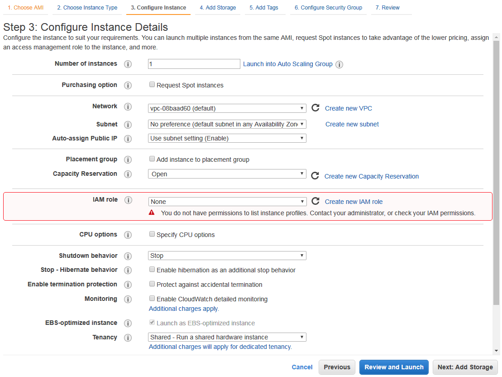
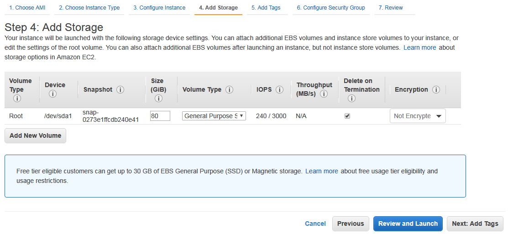
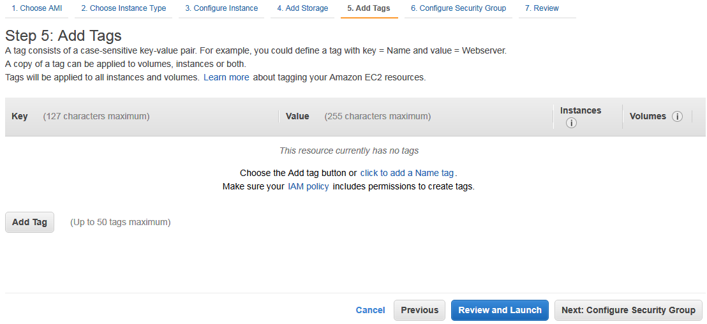

# Getting Started With AWS

## Create an AWS Account

AWS (Amazon Cloud) account creation
Prerequisites:
- Credit card
- Landline or mobile phone

* Navigate to the [AWS official website](https://aws.amazon.com/) and click the “Sign Up” button.
* Fill in all registration information including your personal information and credit card details.
* Next, the system will call to confirm your phone number. Enter the 4-digit number (ending with #) displayed on the computer screen.
* If the account was successfully created, your card will be charged for $1 as part of the verification process (this will be refunded later).

## Create a Suitable EC2 Virtual Machine

EC2 virtual machine set up
##### 1. Create an AWS EC2 instance

Log in to the [EC2 console](https://console.aws.amazon.com/ec2/):

Select the location of the machine in the upper right corner:


Find “Instances” in the menu on the left side of the page


Then click on the “Launch Instance” button:


Choose an Amazon system image: Ubuntu 18.04 is recommended


Select the instance type. We recommend the m4.large configuration.


Click the “Next: Configure Instance Details” button and input the following default configuration:



Click the “Next: Add Storage” button

The recommended setting is 80GB




Click the “Next: Add Tags” button to add tags for easy recall:



Click the “Next: Configure Security Group” button

Add firewall rule and then click the “Review and Launch” button to verify the instance:


Click the “Launch” button to launch the instance


Create a key, download the key pair and keep it in a safe place. You will use this key when logging in with SSH.


That completes the EC2 instance creation.

## SSH login to AWS EC2

To use the SSH login method under Linux, set the key file permissions with the following command (make sure to replace `your_keyfile.pem` with whatever you named your key file):

```  
chmod 400 your_keyfile.pem  
```
SSH login command (make sure to replace `your_EC2_ip_address` with your EC2 instance's IPv4 Public IP address:
```
ssh -i your_keyfile.pem ubuntu@your_EC2_ip_address
```
Windows users should use PuTTY to SSH in, see Amazon's [instructions](https://docs.aws.amazon.com/AWSEC2/latest/UserGuide/putty.html).

## How to Delete an EC2 instance

First terminate the instance:


Confirm termination:


After termination, check that the volume has been deleted to avoid any costs. In addition, the instance will remain in the list for a while after termination, and will generally disappear within half an hour.
