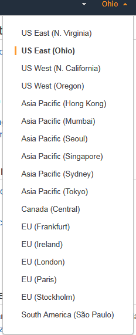
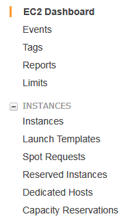
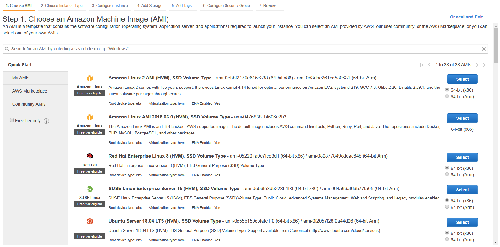
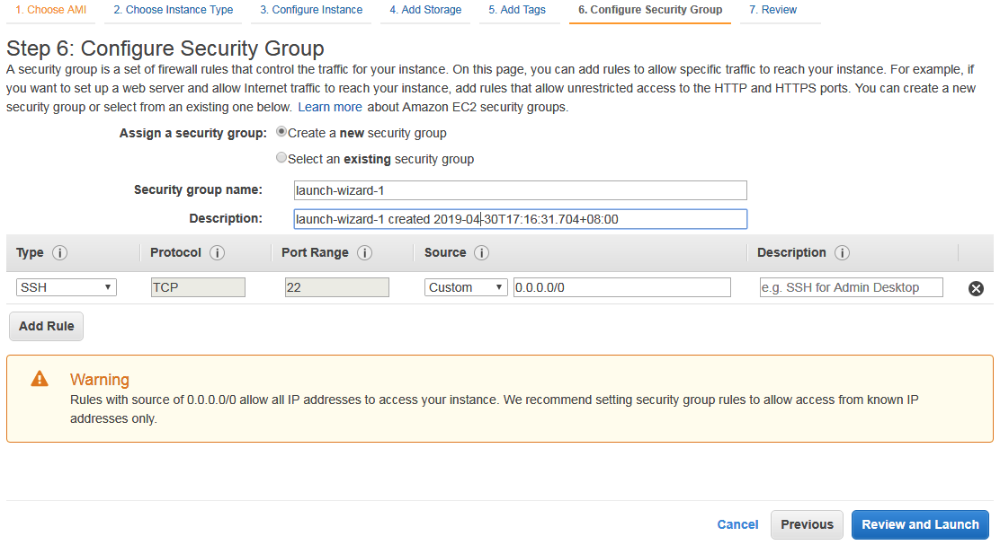
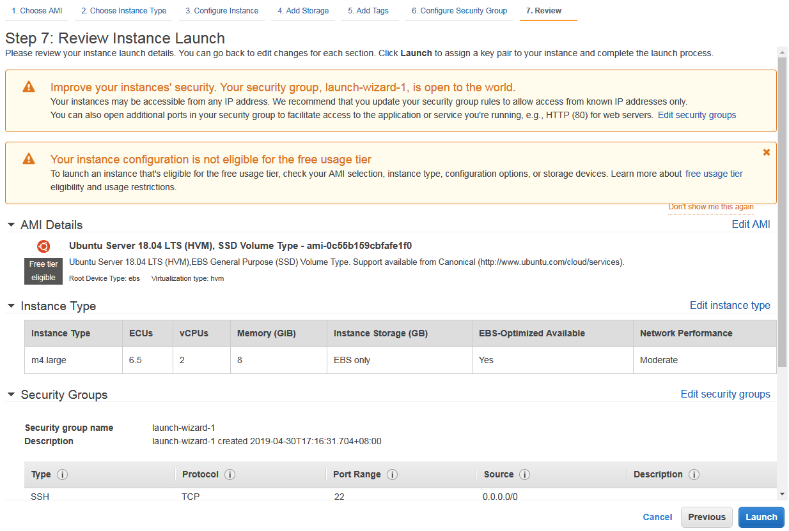
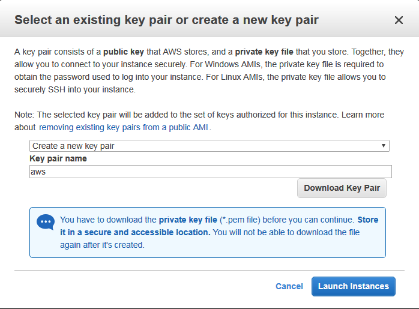
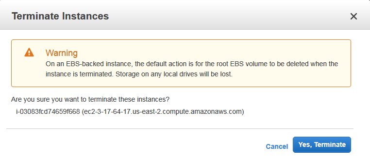

# Contents

Follow the instructions below for a detailed guide to to staking during the beta testing version of Galaxy Consensus.

# 1. Product and Parameter Improvements in Beta version
 
### New Products

* [New desktop light wallet](https://github.com/wanchain/wan-wallet-desktop/releases) — Wan Wallet, WAN token delegation can be done in the GUI wallet (currently testnet only)
* [Wanchain Network Status](https://wanstats.net/) to provide professional users with a visual tracking platform for the status of Wanchain’s network under PoS consensus 
* [New Wanchain Explorer](http://testnet.wanscan.org/) with PoS features plus loads of tracking information and statistics (Link)

### Parameter Updates

* Slot time is reduced from 10 seconds to 5 seconds;
* Epoch time was shortened from 2 days to 1 day;
* The Delegate Ratio was raised from 1:5 to 1:10;
* The granularity of the commission rate is increased from one hundreth (0.01) to one ten thousandth (0.0001);
* The docker image name has been updated to “wanchain/client-go: 2.0.0-beta.5”;
* “Pluto” in the start parameters and instructions is replaced with “testnet”.


# 2. How to apply for the Beta testing, and how to get WAN testnet tokens

##### 1. Download the Wan Wallet and create an address to receive WAN testnet tokens
[Download Wallet](https://github.com/wanchain/wan-wallet-desktop/releases)

**After the Wan Wallet installation, refer to the “Wallet” -> “WAN” page, click “Create” button to create a new address. This address can be used to receive beta testnet tokens.**

*Note: In addition to the light wallet, you can also use the command line to generate an address for receiving testnet tokens. For details, refer to section 8, “How to create a validator node” → “How to create a keystore account using gwan in docker”.*

##### 2. Fill out the Beta test application form and submit the WAN test tokens to the **(NOT mainnet)** address to receive WAN testnet tokens
[Application form](https://forms.gle/5apYwdge9An8ZmMR9)

Upon receipt of the application, we will randomly send a large amount of WAN testnet tokens ranging from 50,000 WAN to 150,000 WAN to the applicant’s WAN address.

For users who only want to perform delegations, they can apply directly through our [faucet website](http://54.201.62.90/). Like the application for Ethereum testnet tokens, the tester needs to publish a tweet with the testnet WAN address, then paste the tweet address into the faucet page in order to apply for 200 WAN testnet tokens per day or more. 

*Note: For users who have participated in the Alpha test, since the Alpha version and the Beta version are running on two separate networks, you must re-apply for the testnet tokens and recreate the node.*

# 3. Beta Testnet Reward Program

**There are 3 categories of rewards for the PoS Beta Testnet:**

##### 1. Completing tasks:

* Successfully set up a validator node (200 WAN)

* The validator node runs for 10 days (200 WAN)

* Absorb a delegation amount higher or equal to the validator’s own staking amount (100 WAN)

##### 2. Bug reporting: Send bug reports to - techsupport@wanchain.org

**Scope: Gwan, Wan Wallet, new Explorer, WanStats and other POS related tools**

Rewards are distributed according to the severity level of valid bug reported (50, 200, 400 WAN for 3 levels of severity). TheWanchain development team owns the whole right to identify the severity level.

##### 3. Security reports: Send security reports to - techsupport@wanchain.org

Finding defects that may affect the security of the wallet, nodes or public chain will be granted a special reward by the Wanchain Foundation. We sincerely encourage experienced teams or individuals to work with the Wanchain R&D team for security testing.

# 4. Interpretation of Terms and Parameters
The Wanchain PoS Consensus research paper can be found [here](https://www.wanchain.org/files/Wanchain-Galaxy-Consensus-V1.0.pdf).

Please see [this article](https://medium.com/wanchain-foundation/wanchain-proof-of-stake-validator-economics-for-upcoming-alpha-testing-d57353a4d0f9) for key terms and see below for key parameters:

##### Parameter summary:

* Delegating Node’s minimum staking amount: 50,000 WAN
* Delegate Ratio: 1:10
* Non-delegating Node’s minimum staking amount: 10,000 WAN, cannot accept delegations
* Minimum threshold for the delegator: 100 WAN
* The number of validator nodes: 75, of which 49 are open to the public, and the Foundation temporarily holds 26 for network security at launch (the Foundation’s nodes operate normally but will not receive rewards, and will gradually be decommissioned and released publicly)
* The maximum amount of staking for a single validator node: 10.5 million WAN. This value is the upper limit of the sum of the validator node’s own staking amount and the delegated amount received by the validator node.
* Rewards: 21,000,000 WAN is reserved by the Foundation as PoS reward; 2,500,000 WAN will be distributed in the first year, and will then decrease by 12% per year.
* Validator node’s locking period: 7 to 90 days, can be freely chosen between this range. After the locking period expires, the staked WAN will become available within one day.
* Delegators’ withdraw period: Staking can be initiated or canceled at any moment. Withdrawal Delay is 1 day if delegator is following the validator’s exit, otherwise the delay is 3–4 days.

# 5. Hardware and Software Requirements
1. Hardware requirements

Since this is a beta test, considering the tester’s server cost and other potential costs, we have not set too many requirements for the hardware environment. Please be sure to use a mainstream hardware configuration or an upper-tier configuration for your cloud server or PC.

The following figure shows the minimum configuration and the recommended configuration of the hardware required to run a validator node after WAN Staking is officially launched, just for reference for the beta test participants.

2. Software requirements

* Linux and MacOS are recommended
* Using Docker to run nodes requires Docker service as a pre-requisite
* Compiling source code requires the installation and configuration of Golang runtime environment: https://golang.org/

# 6. How to Create an AWS Account
AWS (Amazon Cloud) account creation
Prerequisites:
- Credit card
- Landline or mobile phone

* Navigate to the [AWS official website](https://aws.amazon.com/) and click the “Sign Up” button.
* Fill in all registration information including your personal information and credit card details.
* Next, the system will call to confirm your phone number. Enter the 4-digit number (ending with #) displayed on the computer screen.
* If the account was successfully created, your card will be charged for $1 as part of the verification process (this will be refunded later).

# 7. How to Create a Suitable EC2 Virtual Machine

EC2 virtual machine set up
##### 1. Create an AWS EC2 instance

Log in to the [EC2 console](https://console.aws.amazon.com/ec2/):

Select the location of the machine in the upper right corner:



Find “Instances” in the menu on the left side of the page



Then click on the “Launch Instance” button:


Choose an Amazon system image: Ubuntu 18.04 is recommended



Select the instance type. We recommend the m4.large configuration.


Click the “Next: Configure Instance Details” button and input the following default configuration:


Click the “Next: Add Storage” button

The recommended setting is 80GB


Click the “Next: Add Tags” button to add tags for easy recall:


Click the “Next: Configure Security Group” button

Add firewall rule and then click the “Review and Launch” button to verify the instance:



Click the “Launch” button to launch the instance



Create a key, download the key pair and keep it safe. Use it when logging in by SSH.



That completes the EC2 instance creation.

2. SSH login to AWS EC2

To use the SSH login method under Linux, set the key file permissions with the following command:

```  
Chmod 400 aws.pem  
```
SSH login command:
```
Ssh -i aws.pem root@public DNS (IPv4)
```
The PuTTy login on Windows needs to use PuTTyGen to convert .pem to ppk, and select ppk file in Auth option of PuTTy tool.

Delete AWS EC2 instance

First terminate the instance:


Confirm termination:




After termination, check that the volume has been deleted to avoid any costs. In addition, the instance will remain in the list for a while after termination, and will generally disappear within half an hour.

# 8. How to Create a Validator Node
Go to this link https://github.com/wanchain/go-wanchain/blob/develop/docs/WanPoS_getting_started_manual.md

Find Section 4 Quick start from Docker (4.1 Step by Step node setup)

# 9. How to Become a Delegator
Since the Beta version of the light wallet was released, delegators can use the visual interface of the wallet to delegate their WAN in Galaxy Consensus. Delegators may also choose to use the command line to delegate WAN.

9.1 Delegate WAN through Wan Wallet

Wanchain’s Galaxy Consensus has a complete delegation mechanism. As a delegator, a user can select a trusted validator in Wanchain’s network, and delegate his or her WAN to that validator, and get rewards from this kind of indirect staking. The minimum threshold for a delegator is 100WAN.

In the Delegation interface, a user can clearly get the general information of My Stake, My Reward, Average Network Reward and Pending Withdrawal. Meanwhile, he or she can view his or her delegation list and delegation history records.

Click New Delegation, and Select Name and Address under Validator’s Account to choose the node you wish to delegate to, select Address which you want to delegate from under My Account, and input Amount. For the delegation settings, you should pay attention to several parameters:

Quota, which represents how many remaining WAN this validator can receive;

Fee(%), which represents the percentage of WAN which will be deducted from the reward. For example, if the total reward is 50WAN, and the fee is 15%, the delegator will receive a final reward of 42.5WAN.

The following pictures shows a delegator who delegates 100WAN to a validator.

After successful delegation, My Stake shows 100WAN. This delegation record shows in the delegation list. If you want to top-up the delegation amount, you can click Top-up.

After the top-up is successful, the result is as below:

9.2 Delegate WAN through Command Line

Go to this link: https://github.com/wanchain/go-wanchain/blob/develop/docs/WanPoS_getting_started_manual.md

Find Section 4 Quick start from Docker (4.2 Step by Step delegation guide)

# 10. Common Operations
<div id="10"></div> 
Go to this link: https://github.com/wanchain/go-wanchain/blob/develop/docs/WanPoS_getting_started_manual.md

Find Section 6 Common Operations (from 6.1 to 6.6)