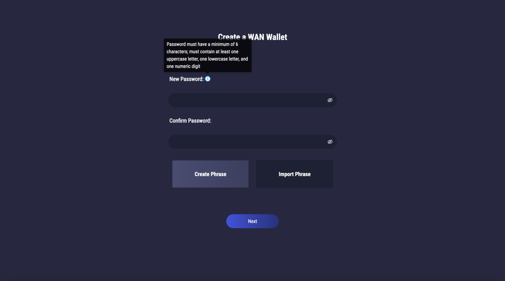
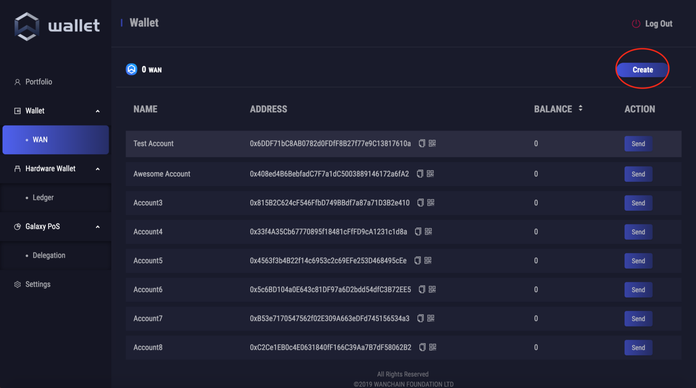
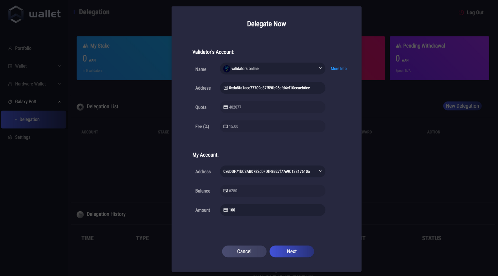
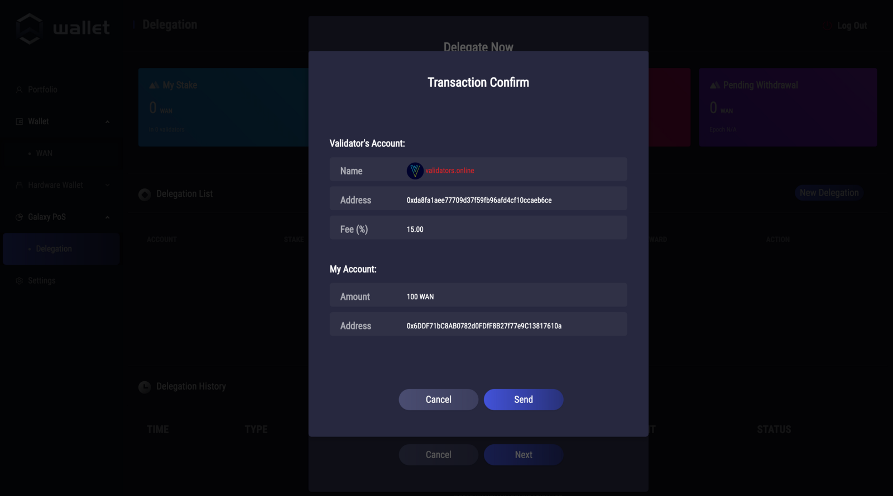
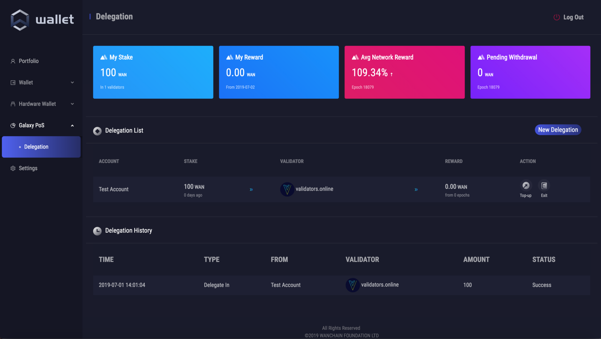
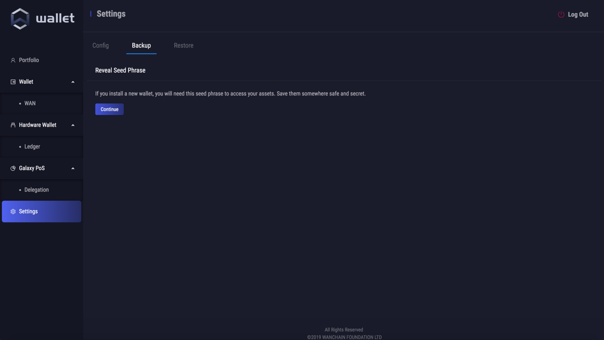
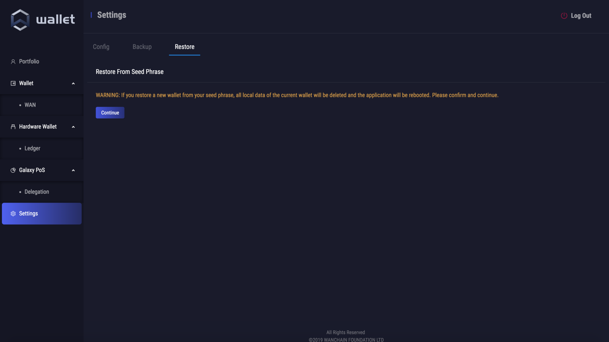

# Wan Wallet (Beta Testnet Version)

## Wallet Features

Wanchain's first official desktop light wallet is available on Mac, Windows, and Linux. The initial release will support these functions:

* WAN asset management
* Standard transfer and receive transactions
* Making and managing delegations under Galaxy Consensus Proof of Stake
* Ledger hardware wallet support

Upcoming features to be implemented before the end of the year include:

* Staking support for validator node operators (will be implemented 3rd quarter along with the launch of Galaxy Consensus on the mainnet).
* Multi-crypto asset management support (4th quarter 2019)
* Private transactions (4th quarter 2019)
* Cross chain transactions (4th quarter 2019)

*Note: The wallet currently only supports the testnet, please do not make any mainnet transactions to an address on the wallet!*

## Download and Install
Download [Wan Wallet](https://medium.com/r/?url=https%3A%2F%2Fgithub.com%2Fwanchain%2Fwan-wallet-desktop%2Freleases) (beta version).

Double click the install package and follow the on screen instructions to install.

## Register New Account

When you first open Wan Wallet, you must register a new account. First set your password:

IMPORTANT: Next record your backup mnemonic phrase. Do not take a screenshot, rather you should write it by hand. Do not share your phrase with anyone. This phrase is the only way to recover your account. 

*Note: this is a throw away account, NEVER share your seed phrase with anyone Click 'Next' to complete the new account registration process.*

## Generate a New Address 

Wan Wallet supports the creation of multiple addresses for one account, simply click: Wallet > WAN > Create

*Wallet > WAN > Create*

Accounts may also be renamed as you wish.

## Normal Transactions
Click 'Send', enter sending and receiving account information along with the transaction amount, select the service fee, and click next, and then click send again to complete your transaction.  

Under 'Advanced Options' are additional parameters which advanced users may adjust.

## Delegation
Wanchain's newly introduced Galaxy Consensus Proof of Stake has a completely non-custodial delegation mechanism. Users may choose from amongst all available validators the one which they trust to send their delegations too. By delegating their stake to validator nodes in this way, all users have the opportunity to earn consensus rewards. The minimum required amount for delegation is 100 WAN. 

Within the delegation interface users may clearly check their amount of staked WAN, their accumulated rewards from delegation, the yearly return rate for the entire network, and pending withdrawals. Users can also check a table of all their previous delegation transaction history. 

In order to make a new delegation, click 'New Delegation', choose a validator from the list, under 'My Account', choose the account from which you would like to delegate, and enter the amount you would like to delegate in the 'Amount' field. During the process of delegation, there are several parameters you should pay attention to. First, the validator's 'Quota' represents the amount of WAN that validator is able to accept in delegations. Please also note the 'Fee' parameter. This parameter is the percent fee charged as commission by the validator. For example, if the network reward is 50 WAN and the fee is 15%, then you will receive 42.5 WAN as your reward, and 7.5 WAN will be paid to the validator.

In the images below, a user is delegating 100 WAN to a validator node. 

After a completing a delegation, you can see 100 WAN displayed under "My Delegations." Previous delegation details may be viewed from within the delegations history. If the user wishes to increase their delegation, they may click on the 'Top up' button.

## Connecting a Hardware Wallet
After the Wanchain mainnet officially moves over to proof of stake, Wan Wallet will support the Ledger hardware wallet.

(NOTE: The current beta test version of the wallet does not support Ledger)

## Settings
There are currently three selections under settings, 'Config', 'Backup' and 'Restore'.

Under 'Config', you may choose to require your password to be input for every transaction.

Under 'Backup', you may enter your password to get your backup mnemonic phrase.

Under 'Restore', you may enter your backup phrase to restore a previous wallet.

## Multilingual Support
Under Settings > Language, you may choose between English and Mandarin Chinese. In the future, we will add support for French, Spanish, Japanese, Korean, and other languages.

Thank you for downloading and testing the new Wan Wallet! If you have any questions, please feel free to get in touch at techsupport@wanchain.org.  