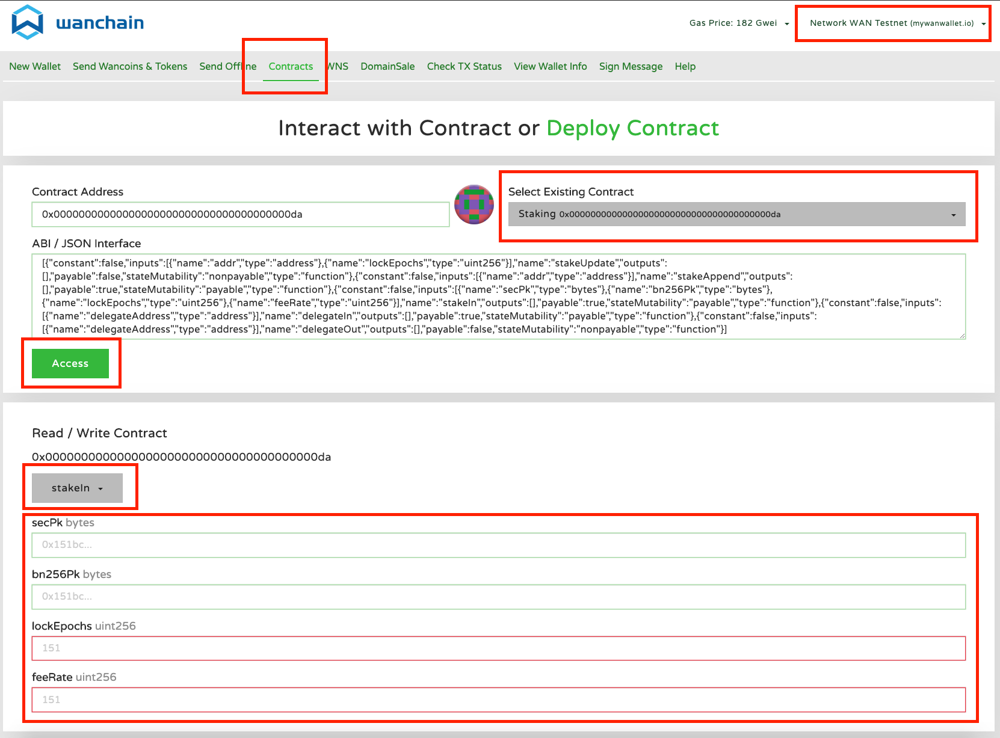
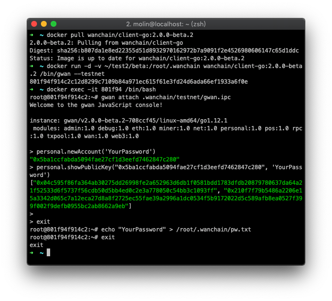

# 如何创建成为验证节点

### 1）安装 docker(Ubuntu):

```
$ sudo wget -qO- https://get.docker.com/ | sh

$ sudo usermod -aG docker YourUserName

$ exit
``` 

### 2）使用docker中的gwan创建keystore账号：

注意：下文中的YourUserName，YourContainerID，YourAccountAddress，YourPassword，YourPK1，YourPK2均为替代词，并不是命令本身，应根据实际情况，替换成自己的定制值；

- YourUserName：替换成你的用户名；
- YourContainerID：返回的DockerID，这个不是输入的，是返回的输出信息；
- YourAccountAddress：返回的创建好的地址；
- YourPassword：设定你的自定义的合适的密码；
- YourPK1、2：返回的你账号的2个公钥信息，注册validator时需要；

```
$ docker pull wanchain/client-go:2.0.0-beta.5

$ docker run -d -v /home/YourUserName/.wanchain:/root/.wanchain wanchain/client-go:2.0.0-beta.5 /bin/gwan --testnet

YourContainerID

$ docker exec -it YourContainerID /bin/bash

root> gwan attach .wanchain/testnet/gwan.ipc

> personal.newAccount('YourPassword')

"YourAccountAddress"

> personal.showPublicKey("YourAccountAddress", 'YourPassword')

["YourPK1", "YourPK2"]

> exit

root> echo "YourPassword" > /root/.wanchain/pw.txt

root> exit
```



### 3）确保您的测试账户地址拥有足额的WAN测试币（运行普通验证节点至少大于10,000WAN，运行受托验证节点至少大于50,000WAN）
 
如果已经使用钱包账号申请过测试币，可以手动将测试币转账到上文创建的validator账号中，完成后续步骤。

### 4）创建一个验证节点注册脚本文件
`/home/YourUserName/.wanchain/validatorRegister.js`

```
//validatorRegister.js

// If you want to register as a validator you can modify and use this script.


//-------INPUT PARAMS SHOULD BE REPLACED WITH YOURS--------------------

// tranValue is the value you want to stake - minValue is 100000 
var tranValue = "100000"

// secpub is the validator node's secpub value
var secpub    = "YourPK1"

// g1pub is the validator node's g1pub value
var g1pub     = "YourPK2"

// feeRate is the percent of the reward kept by the node in delegation - 100 indicates the node does not accept delegation.
var feeRate   = 100

// lockTime is the length of stake locking time measured in epochs - minimum required locking time of 5 epochs
var lockTime  = 30

// baseAddr is the stake funding source account
var baseAddr  = "YourAccountAddress"

// passwd is the stake funding source account password
var passwd    = "YourPassword"

//-------INPUT PARAMS SHOULD BE REPLACED WITH YOURS--------------------


//------------------RUN CODE DO NOT MODIFY------------------
personal.unlockAccount(baseAddr, passwd)
var cscDefinition = [{"constant":false,"inputs":[{"name":"addr","type":"address"},{"name":"lockEpochs","type":"uint256"}],"name":"stakeUpdate","outputs":[],"payable":false,"stateMutability":"nonpayable","type":"function"},{"constant":false,"inputs":[{"name":"addr","type":"address"}],"name":"stakeAppend","outputs":[],"payable":true,"stateMutability":"payable","type":"function"},{"constant":false,"inputs":[{"name":"secPk","type":"bytes"},{"name":"bn256Pk","type":"bytes"},{"name":"lockEpochs","type":"uint256"},{"name":"feeRate","type":"uint256"}],"name":"stakeIn","outputs":[],"payable":true,"stateMutability":"payable","type":"function"},{"constant":false,"inputs":[{"name":"delegateAddress","type":"address"}],"name":"delegateIn","outputs":[],"payable":true,"stateMutability":"payable","type":"function"},{"constant":false,"inputs":[{"name":"delegateAddress","type":"address"}],"name":"delegateOut","outputs":[],"payable":false,"stateMutability":"nonpayable","type":"function"}];


var contractDef = eth.contract(cscDefinition);
var cscContractAddr = "0x00000000000000000000000000000000000000da";
var coinContract = contractDef.at(cscContractAddr);

var payload = coinContract.stakeIn.getData(secpub, g1pub, lockTime, feeRate)
var tx = eth.sendTransaction({from:baseAddr, to:cscContractAddr, value:web3.toWin(tranValue), data:payload, gas: 200000, gasprice:'0x' + (200000000000).toString(16)});
console.log("tx=" + tx)
//------------------RUN CODE DO NOT MODIFY------------------
``` 




脚本中的FeeRate字段为受托验证节点的委托费率，其值为0-100。如果FeeRate字段设为100，则表示受托节点不接受委托。如果FeeRate字段设为10，则表示受托节点收取委托人10%的收益后，再与委托人按共识系统设计的算法进行收益分配。如果FeeRate字段设为0，则表示受托节点不收取委托费率，即与委托人按共识系统的算法将全部收益进行分配。
 
### 5）在gwan中执行脚本
如果2）中的docker没有关闭，可以直接按下述代码进入执行，如果已关闭，请重新启动：

```
$ docker exec -it YourContainerID /bin/gwan attach .wanchain/testnet/gwan.ipc

> loadScript("/root/.wanchain/validatorRegister.js")

> exit

$ docker stop YourContainerID

$ docker run -d -p 17717:17717 -p 17717:17717/udp -v /home/YourUserName/.wanchain:/root/.wanchain wanchain/client-go:2.0.0-beta.5 /bin/gwan --testnet --etherbase "YourAccountAddress" --unlock "YourAccountAddress" --password /root/.wanchain/pw.txt --mine --minerthreads=1 --wanstats your-node-name:admin@54.193.4.239:80
```

其中参数中的“--wanstats your-node-name:admin@54.193.4.239:80”部分是PoS beta测试用于统计节点和PoS网络运行情况的。
“your-node-name”请自定义为您想要的节点名称，例如“Community-WAN-node_EMEA1”，请避免使用大小写字母，数字，“-”，“_”以外的字符。
您可以通过WanStats网站来查看这些信息，Beta测试阶段WanStats的网址为：http://54.193.4.239/

执行完上述脚本，即可完成开启验证节点的权益挖矿（Staking）运行。测试者可通过 
```
docker logs -f `docker ps -q` 
```
命令查看工作日志。
注：权益挖矿工作，将在所有块同步完成后正式开始。当前测试网数据较大，同步时间可能需要几个小时，请耐心等待。


以下是如何注册成为验证节点的教学视频，请结合上文提供的代码进行观看：

