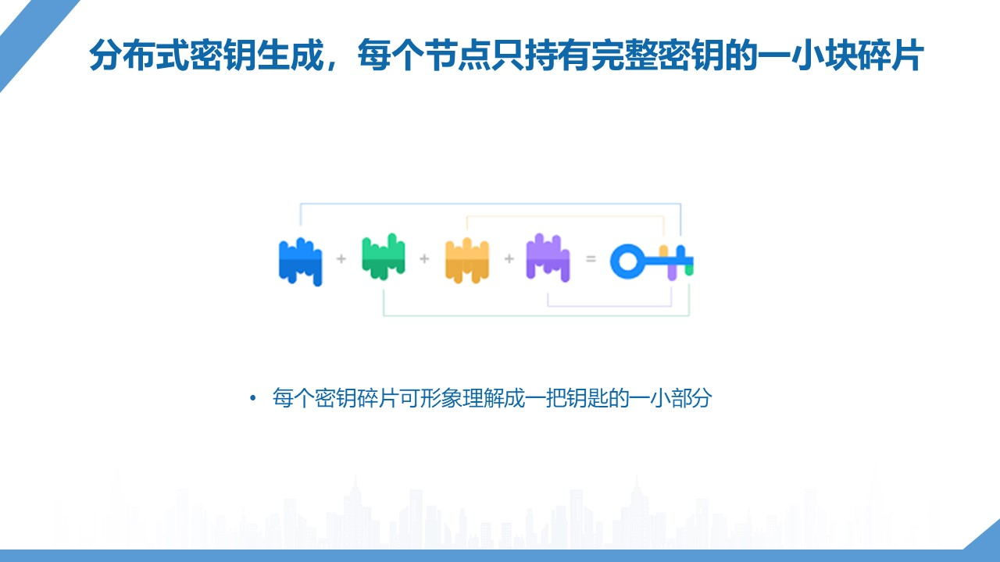

# Wanchain星系共识深入解读

## 第一章 整体架构与流

星系共识（Galaxy Consensus）是万维链理论研发团队全新提出的高效、科学、安全的实用型PoS共识协议，旨在替代原本高能耗的PPoW（permission proof-of-work），也将万维链的共识系统正式开放给广大社区，迈出完全去中心化的关键一步。在当前众多区块链系统百家争鸣的形势下，安全高效的共识协议已经成为大家主要的研究方向之一，PoS、PoA、PoI等等众多共识模型被相继提出，而在众多共识模型中，经过谨慎的思考，万维链认为权益才是左右链上治理和发展的根本因素，也就研发了PoS星系共识协议，在群星璀璨的共识节点运转下，打造属于万维链的共识星系。

### 一、整体框架设计
对于共识协议的设计来讲，主要解决的就是两个核心问题：出块者选择（Leader selection）和合法链选择（Chain selection）。在传统的PoW中，出块者的选择是通过挖矿进行的，借助的是哈希函数的随机性，矿工依赖自身的计算能力参与出块者竞争，而这里的公平性就体现在任何节点对哈希函数结果的不可预测性，任何节点都没有优势可言，只能通过简单粗暴的穷举运算来解决问题。合法链的选择上往往也是采取最长链的规则，也就是让算力最大的分支成为主流。这样挖矿+最长链规则的框架设置下就导致了大量的能源浪费，也是其他共识协议被提出的根本原因之一。那么当前主流的PoS协议又是通过怎样的框架设计来解决这一问题的呢？

经过长期的调研学习，我们以三种知名的共识协议来简单介绍PoS共识的主流框架：

Cardano的Ouroboros是发表在美密会上的顶尖学术论文，也是第一个被工业界采用的可证明安全PoS算法，其卓越的贡献就在于提出了可证明安全的共识模型框架，并在其中设计了实用的算法模块。在其多个系列版本中，出块者选择上也有不同的方式，由最初利用随机数的确定性选择到采用VRF算法的匿名选择，Ouroboros逐渐将选择的过程隐私化安全化，而有效链的选择上一直是最长链规则，也就是chain based方式，保证了链的安全性。所以Ouroboros的整体框架就是VRF selection + Chain based模式。

Algorand是由图灵奖得主、MIT教授Sivio Micali提出的PoS共识协议，其突出贡献在于设计了BFT的升级协议BA*协议，利用投票的方式解决了区块合法性的选择，在出块者和验证者的选择上Algorand也采用了VRF算法，保证了随机性和匿名性，经过BA*协议的运行，保证每一个高度的区块都是被确认的，即使最终是空区块，也是经过投票认证的。所以Algorand的整体框架就是VRF + BA*投票模式。

Casper是以太坊当前研究开发的PoS共识协议，秉持着实用性的特点，Casper采用了投注式共识，完成保证金质押的验证者可以投注自己相信会被确认的区块，在投注规则的限制下保证了最终胜出区块的唯一性，而胜出的验证人也将得到收益。Casper将帮助以太坊由PoW转型为PoS，也是大家十分期待的共识协议。所以Casper的整体框架就是验证人 + 投注的模式。

简单介绍了几种主流PoS共识协议之后，我们回归到星系共识，经过深入的思考研究，星系共识坚持学术派的发展路线，借鉴了Ouroboros可证明安全的模型框架，全新设计更加高效安全的随机数生成算法，并创新性设计Unique Leader Selection算法替代VRF算法，用于出块者选择，保证了合法出块者的唯一性，大大降低了自然分叉概率，所以星系共识的整体框架就是ULS + Chain based，在保证安全性的前提下极大地提升了实用性。

### 二、两类星体，代表两种共识节点角色

在星系共识之中，所有在智能合约中质押了WAN的用户都将成为整个星系中的一个节点，而这些节点由于能力的大小被分为两种星体：验证节点，即恒星（star）和委托人，即行星（planet）。
 
为区分两种星体，这里就不得不说星系共识中的委托机制，为了给仅持有少量WAN或权益较小的用户提供参与共识的机会，在星系共识中我们设计了完整的委托机制。委托机制的实现是基于三重ECDSA委托签名算法，对当前的区块链系统有着天然的兼容性，通过委托机制，持有少量WAN的用户可以将自身权益委托给代理节点，由代理节点参与共识的运行，同时由于签名消息空间的限制，代理节点只能代为出块，无法进行其他操作，保证了用户权益的安全性。
 
了解了委托机制，就可以介绍两种星体的不同。在星系共识中的两类星体：

恒星节点：是可以接受委托的共识节点，其自身持有一定量的权益，而且其自身权益值将影响其接受委托的权益上限；

行星节点：是不可以接受委托的共识节点，其参与共识完全依赖于自身持有的权益值。
 
虽然两种星体能力大小有所区分，但在参与共识的过程中是相同的，并不做区分。希望成为恒星节点，一方面需要更多的权益质押，另一方面也取决于节点的信誉程度，最终方法后续将有详细说明。
 
### 三、两类星群，负责构建链上随机数和收集交易、打包出块

星系共识之中，参与节点由于任务分工被划分为两个星群：RNP星群和EL星群。这两个星群都是在所有星系共识节点中，按照自身持有权益比例选择出来的。但是承担的任务不同，主要解决了共识中的两个关键问题：
 
RNP星群是负责构建链上随机数的群体。RNP星群中的节点通过DKG1、DKG2、SIGN三个阶段的工作完成随机数的更新，保证了链上随机数的安全性。正如上面介绍的主流PoS框架所说，如何维护一个公平的随机数是保证协议安全的重中之重，RNP星群正是承担着这一关键性工作，其每一轮产生的随机数将作为星群构建、出块者选择和其他随机源应用的重要种子，维持着共识的健康运转。
 
EL星群是负责收集交易、打包出块的群体。EL星群需要完成两个周期的工作，第一个周期通过SMA1、SMA2两个阶段完成秘密信息序列（secret message array）的协商，完成EL星群内部秘密数据的共享，第二个周期通过秘密信息序列和链上随机数确定出块权归属，并在自身负责出块的时间段内打包区块并广播，完成链的生长发展，其作用毋庸置疑，是保证共识安全运行的基础。
 
### 四、星系共识运行流程

介绍了两种星体和两类星群之后，我们从一个较高的视角整体的描述星系共识的运行流程，给大家一个直观的展现，看看星系共识是如何运行的。首先我们介绍两个时间上的概念：slot和epoch。相信了解过Ouroboros的读者对这两个概念应该并不陌生，slot是一个区块的生成时间，即每个slot内产生一个新的区块；epoch是由大量连续slot构成的时间周期，是协议完整运行的一个循环。下面分四个步骤讲述协议运行流程：
 
**1. 构建星系**

这是协议运行的准备阶段，在这一阶段，所有想要参与星系共识的节点通过在共识智能合约中质押一定量的WAN成为星系节点，质押时会选择锁定时间，这一时间将影响节点的权益值，锁定时间越长，权益值则相应略高，同时权益值随着锁定时间的流逝也将呈增长趋势，这一设计很好的模拟了币龄的概念，确保了权益设计的合理性和节点参与的公平性。经过这一阶段的准备，星系中就出现了大量的节点，这些节点将正式运转星系共识。
 
**2. 组建星群**

在每次协议运行周期（epoch）的起始，星系中会选择出两大星群，即RNP星群和EL星群，这两大星群的选择是基于节点持有权益值的比例，利用链上随机数进行的随机选择过程，类似于follow-the-satoshi，这里我们使用follow-the-stake-ratio，保证了星系节点参与组建星群的公平性，权益占比越高，被选入星群的概率越大，参与共识进而获得收益的可能性就越大，这也是PoS共识的核心思想之一。
 
**3. RNP星群运转**

RNP星群被选择组建之后，星群中的节点完成DKG1、DKG2和SIGN三个阶段的工作，在DKG1阶段，各节点提出自身对随机数碎片选择的承诺，保证了碎片选择的不可更改性，在DKG2阶段，各节点将自身选择的随机数碎片通过门限秘密分享的方式分享给星群中的其他节点，最终在SIGN阶段，各节点公布自身收集的随机数碎片数据，完成随机数的生成，更新链上随机数数据。整个过程由于门限秘密分享的特点，保证了只要在线节点数超过门限值就将顺利完成随机数的更新，确保了随机数生成的可靠性，同时只要星群中至少一个节点在随机数碎片的选择上是随机的，那么最终随机数结果就是随机的，保证了随机数生成的安全性。
 
**4. EL星群运转**

EL星群被选择组建后，将参与两个周期（epoch）的工作。在第一个周期中，EL星群节点参与SMA1和SMA2两个阶段工作。在SMA1阶段，各节点提出自身秘密信息的承诺数据，保证了秘密信息的不可更改性，在SMA2阶段，各节点将自己的秘密信息加密共享给其他节点，完成秘密信息序列（secret message array）的生成。在第二个周期起始时，EL星群中的节点会依据RNP星群产生的随机数进行排序，这一排序在整个周期中有效，同时依据秘密信息序列执行出块者选择算法，确定整个周期内各时间段（slot）的出块权归属，这一过程是在EL星群内部秘密执行的，其他节点无法获知结果，而EL星群中节点就依据出块权的归属完成整个周期内新区块的生成。当新区块被提出时，EL星群中的节点要添加自身合法性的凭证，这一凭证可被全网验证，确保了链的正常安全发展。通过以上的介绍了PoS星系共识的整体框架和运行流程。其中更详细的内容，可以在星系共识论文中找到具体的描述。
 
以上简单介绍了星系共识的整体框架和运行流程，详细内容在星系共识论文中有着具体的描述，在后续的星系共识探索中我们会再深入介绍其中各模块组件的设计思想和运转流程，为大家逐步呈现星系共识系统的完整蓝图。

## 第二章 随机数生成算法

在上一篇解读文章中，我们介绍了星系共识的整体框架和流程。在共识过程中，节点会组建成两大星群——RNP星群和EL星群，前者负责随机数的生成，后者负责打包交易提出区块。本文将深度介绍星系共识的随机数生成算法以及其所具有的优势和对共识协议运行的重要作用。
 
### 一、随机数对于区块链系统的重要作用

在正式谈随机数的作用之前，我们需要了解一个概念，那就是“熵”（entropy）。熵对于物理学领域的朋友一定不会陌生，它是体系混乱程度的度量。在1948年，香农（Claude Elwood Shannon）提出了信息熵的概念，去描述信源的不确信度。简而言之，熵就是不确定性的度量。举一个简单的例子：“北京明天的天气状况”，可能是晴天，也可能是阴天或者下雨，结果是不确定的，因此熵为正数；“地球明天要毁灭”，我们知道地球明天不会毁灭，这是确定的结果，因此熵为零。

（此图来自网络，侵删）

那么熵和区块链系统有何关系呢？可以说，熵对于区块链系统是至关重要的，是整个系统运行的安全保障。以比特币系统为例，它采取PoW作为共识算法，矿工进行大量哈希计算去争夺出块权，任何高度区块的出块者身份都无法提前预测，这就是熵在比特币系统中的体现。试想如果熵为0，即每个区块的出块者都是事先确定的或者人为可控，那么必然会出现合谋、分叉等攻击。因此任何区块链系统都需要一种安全有效的方式为系统引入熵。基于PoW共识的区块链系统由于挖矿的随机性，以天然的方式为系统引入了熵，然而对于PoS和DPoS共识的区块链系统，就需要单独设计一种方式去引入熵，那就是随机数生成算法。可以说随机数生成算法是设计共识机制的主要挑战之一，也是衡量共识机制优劣的重要标准之一。
 
### 二、随机数生成算法优劣的衡量标准

既然随机数生成算法这么重要，那么一个好的随机数生成算法应该是什么样子呢？从安全和实用角度而言，它应当满足以下六大性质：

- 去中心化（Distributed）：随机数的生成过程要是去中心化的，不能依赖或者借助可信第三方完成。
- 不可预测（Unpredictable）：根据历史产生的随机数或其他信息无法预测未来的随机数，这是“随机”的基本要求。
- 无偏性（Unbiased）：任何人都无法通过计算能力或者后发优势去针对性左右随机数的生成结果。
- 均匀分布（Uniformity）：输出的随机数在其值域内是均匀分布的。
- 保证输出（Guaranteed Output Delivery）：随机数生成算法的参与者无法通过违背算法的方式使得无法输出随机数，即必然会有随机数输出。
- 公开可验证（Publicly Verifiable）：没参与随机数生成的节点可以以后验的方式，监督协议的执行，验证随机数是可信和无偏的。
 
以上六大性质对于随机数生成算法至关重要，违背其中任意一条都可能会导致严重的安全漏洞。据区块链安全公司PeckShield披露，EOS上有超过8个竞猜项目遭受黑客攻击并获利几百万美元，严重威胁到了EOS正常生态秩序，而大部分攻击成功的原因都与随机数生成漏洞有关。我们以EOS.WIN项目为例，剖析其随机数算法漏洞根源。

EOS.WIN支持的一个游戏是猜数字，即用户输入某个数字并压大或者压小，然后系统随机生成一个数字，如果用户压对大小，则视为中奖并获取收益。显然如果能够控制系统随机生成的数字，就可以左右游戏的结果。而决定EOS.WIN系统随机数生成的因素为交易哈希ID、成交区块高度、成交区块前缀、全局开奖序号等。其中成交区块高度、成交区块前缀虽然是未来某区块信息，但是在实施过程系统指定使用当前同步到的最新块信息，因而是确定的；同时，交易哈希ID能够通过交易内action结合块信息预先计算。于是随机数的生成仅依赖于全局开奖序号了。攻击者利用不断制造错误交易，造成交易状态回滚，控制全局开奖序号，从而控制随机数的生成，直到中奖。显而易见，EOS.WIN的随机数生成算法不满足上述的第二条性质（不可预测性）和第三条性质（无偏性），因此存在漏洞，最终被攻击者有效攻击。
 
### 三、星系共识随机数生成算法
 
星系共识中的RNP星群借助承诺、零知识证明、门限秘密分享、门限签名、椭圆曲线序对等多种密码学手段，实现了安全高效的随机数生成算法，为整个共识过程安全提供了数据基础。为了能够形象介绍随机数生成算法的设计初衷以及其精妙之处，我们将其类比一个简单的游戏：

纸牌游戏： Alice和Bob玩纸牌游戏，两人分别秘密选一张扑克牌放在桌面下方，选定之后，同时将纸牌亮在桌面上。如果两张纸牌的点数和为偶数，则Alice获胜；否则，为Bob获胜。

这个游戏看似简单，但是在区块链上公平的进行并不容易，要通过多种手段防止Alice或者Bob作弊。我们接下来一步一步分析：
 
问题1：Alice和Bob选定之后就不能再更换扑克牌，否则就可以根据对方扑克牌的点数决定自己扑克牌点数，从而获取胜利。例如，Alice如果可以更换扑克牌，那么只要保证自己所选扑克牌和Bob的扑克牌点数具有相同奇偶性，那么点数和总为偶数，Alice便可以获胜。
 
星系共识通过使用“承诺”（Commitment，在配图中用CM指代Commitment）的方式来保证不会发生以上作弊行为。“承诺”是一种密码学工具，能够保证在不暴露原始数据的基础上，将其进行“证据留存”，它和明文是一一对应的，任何人都可以验证二者的对应关系是否成立。

结合我们的例子形象理解就是，Alice和Bob将自己选定扑克牌撕一个小角下来，放在桌面上，这个小角不会暴露扑克的点数，而且只与撕坏的另一部分才能够拼接为一张完整的扑克牌。在星系共识协议中，这是Random Beacon的DKG1（Decentralized Key Generation）阶段，每个RNP（Random Number Proposer）节点计算其所选数据的承诺并发送到链上进行存证。
 

 
问题2：Alice和Bob在选好扑克牌之后，在正式亮牌之前要对自己的扑克牌保密，不能让对方看到。同时在亮牌时候要证明这张牌确实是之前选定的牌，而不是新选的另一张牌。
 
星系共识通过公钥加密算法加密原始数据，之后将加密结果发送到链上，保证了数据的机密性；同时使用零知识证明保证上链的加密数据与承诺完全匹配。结合我们的例子形象理解就是，Alice和Bob将被撕过角的牌从桌下取出，扣在桌面上，并且二者都验证扣在桌面上的牌与之前放在桌上的小角能够拼接为一张完整的纸牌。在星系共识协议中，这是Random Beacon的DKG2阶段，每个RNP节点将其给其他节点的数据通过对方公钥加密之后发送到链上（下图中S1，S2，Sn为经公钥加密后的链上数据），同时发送到链上的还有DLEQ-Proof（非交互零知识证明），用于证明加密内容与承诺CM是匹配的。这个阶段之后，所有节点都可以从链上获取其他节点发送的数据，并且在本地解密为明文。

问题3：开牌之后，需要计算两张扑克牌的点数。我们要保证Alice和Bob都要计算出同一正确结果。这个问题看似很荒唐，但是却非常重要。因为某位玩家可能会装疯卖傻，故意计算错数字，从而降低游戏进行的效率。
 
星系共识通过使用分布式密钥生成的算法解决了问题3，即所有RNP节点通过交互生成一个共同的组密钥（group secret key），这个密钥不会完整出现，而是分割为密钥碎片，每一个RNP节点掌握一个密钥碎片。之后，RNP节点能够合成组密钥签名，而签名的哈希值即为最终的随机数输出。由于组密钥是公共确定的，因此组密钥签名也是唯一固定的。结合我们的例子形象理解就是，Alice和Bob会计算得到共同的点数。

 
问题4：此时，无论是Alice还是Bob都不能够终止游戏的进行。也就是一旦游戏开始，就一定要正常结束，不能因为某一玩家拒绝配合游戏规则而导致游戏流产。
 
星系共识通过门限签名的方式解决了问题4，即只要超过门限值数量的RNP节点参与计算，就能够合成组密钥签名。个别RNP节点拒绝参与计算并不会影响结果的生成。结合我们的例子形象理解就是，即使Alice不想亮牌，Bob也有能力将两张牌亮出，从而完成游戏。
 
以上过程对应于星系共识协议中Random Beacon的SIGN阶段，在这一阶段中RNP节点合作生成组密钥签名并计算得到随机数输出。

现在我们把上述过程梳理一下：1. Alice和Bob扑克牌的点数之和是二者共同决定的；2. 每一局游戏的点数和都是独立的，不存在相互依赖的关系，因此历史游戏数据没有预测作用；3. Alice和Bob都无法提前知道对方的扑克牌点数，因此没有后发优势去左右点数之和；4. Alice和Bob可以选择任何一张扑克牌，因此点数分布是均匀的；5. Alice和Bob都无法中断游戏的进行；6. 任何第三方都可以对游戏过程进行审计，因为所有数据都在链上存证。
 
由以上分析可知，星系共识的随机数算法满足前文提到的六大性质，是安全高效的随机数生成算法。
 
本次对星系共识的随机数生成算法的解读到此结束，相信您已经有了更加深刻的认识。下次我们将对星系共识的Unique Leader Selection (ULS)算法进行解读。
