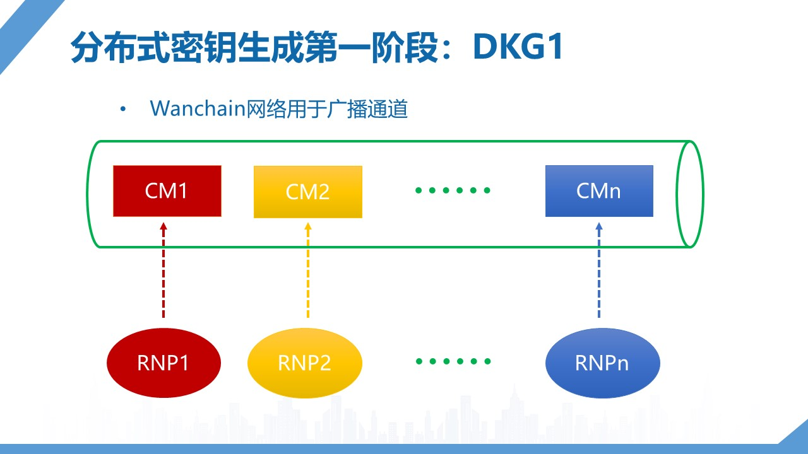
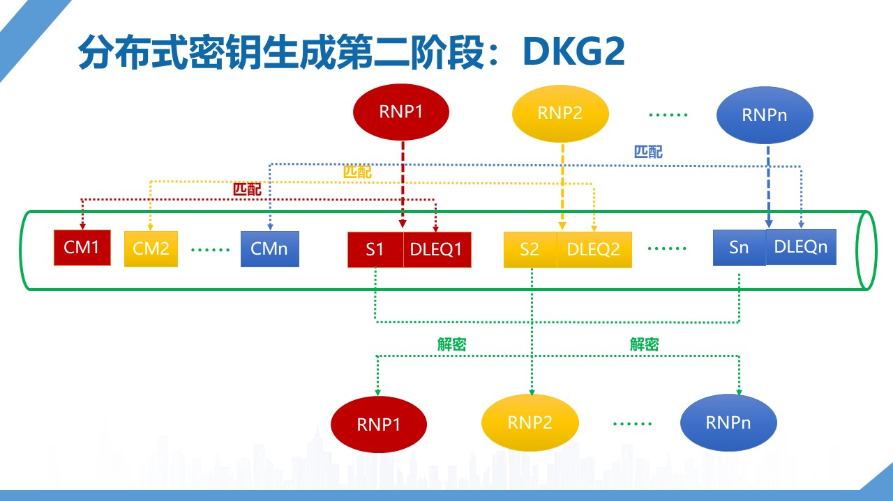
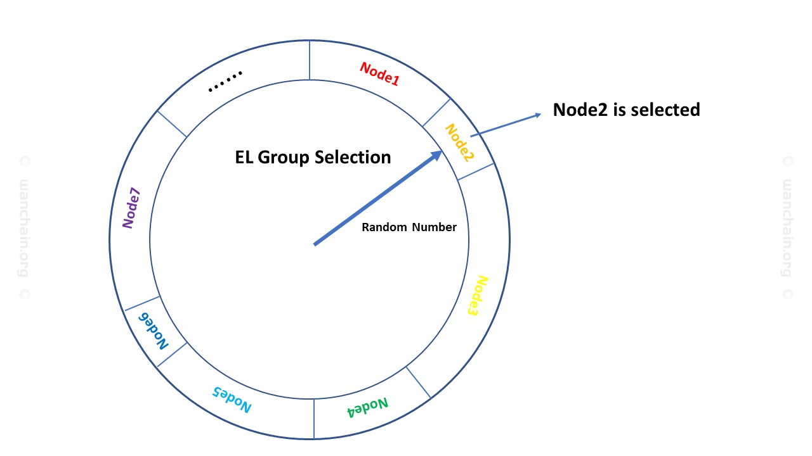
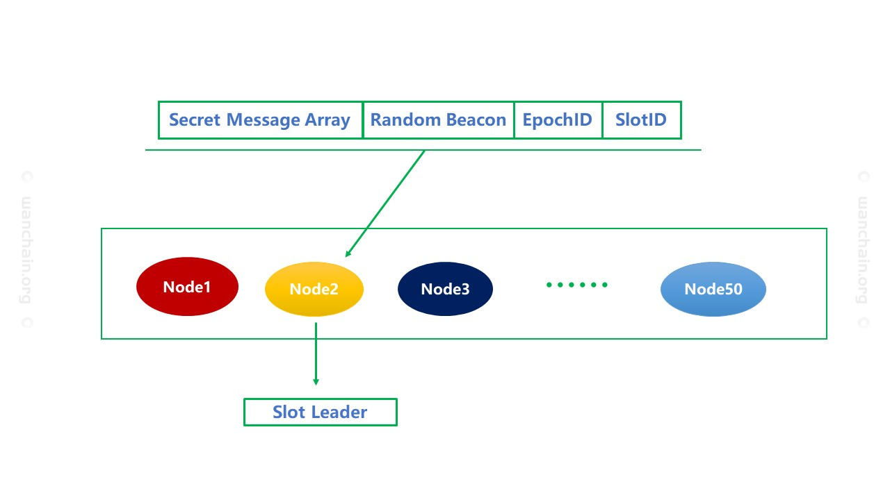

# Wanchain星系共识深入解读

## 第一章 整体架构与流

星系共识（Galaxy Consensus）是万维链理论研发团队全新提出的高效、科学、安全的实用型PoS共识协议，旨在替代原本高能耗的PPoW（permission proof-of-work），也将万维链的共识系统正式开放给广大社区，迈出完全去中心化的关键一步。在当前众多区块链系统百家争鸣的形势下，安全高效的共识协议已经成为大家主要的研究方向之一，PoS、PoA、PoI等等众多共识模型被相继提出，而在众多共识模型中，经过谨慎的思考，万维链认为权益才是左右链上治理和发展的根本因素，也就研发了PoS星系共识协议，在群星璀璨的共识节点运转下，打造属于万维链的共识星系。

### 一、整体框架设计
对于共识协议的设计来讲，主要解决的就是两个核心问题：出块者选择（Leader selection）和合法链选择（Chain selection）。在传统的PoW中，出块者的选择是通过挖矿进行的，借助的是哈希函数的随机性，矿工依赖自身的计算能力参与出块者竞争，而这里的公平性就体现在任何节点对哈希函数结果的不可预测性，任何节点都没有优势可言，只能通过简单粗暴的穷举运算来解决问题。合法链的选择上往往也是采取最长链的规则，也就是让算力最大的分支成为主流。这样挖矿+最长链规则的框架设置下就导致了大量的能源浪费，也是其他共识协议被提出的根本原因之一。那么当前主流的PoS协议又是通过怎样的框架设计来解决这一问题的呢？

经过长期的调研学习，我们以三种知名的共识协议来简单介绍PoS共识的主流框架：

Cardano的Ouroboros是发表在美密会上的顶尖学术论文，也是第一个被工业界采用的可证明安全PoS算法，其卓越的贡献就在于提出了可证明安全的共识模型框架，并在其中设计了实用的算法模块。在其多个系列版本中，出块者选择上也有不同的方式，由最初利用随机数的确定性选择到采用VRF算法的匿名选择，Ouroboros逐渐将选择的过程隐私化安全化，而有效链的选择上一直是最长链规则，也就是chain based方式，保证了链的安全性。所以Ouroboros的整体框架就是VRF selection + Chain based模式。

Algorand是由图灵奖得主、MIT教授Sivio Micali提出的PoS共识协议，其突出贡献在于设计了BFT的升级协议BA\*协议，利用投票的方式解决了区块合法性的选择，在出块者和验证者的选择上Algorand也采用了VRF算法，保证了随机性和匿名性，经过BA\*协议的运行，保证每一个高度的区块都是被确认的，即使最终是空区块，也是经过投票认证的。所以Algorand的整体框架就是VRF + BA*投票模式。

Casper是以太坊当前研究开发的PoS共识协议，秉持着实用性的特点，Casper采用了投注式共识，完成保证金质押的验证者可以投注自己相信会被确认的区块，在投注规则的限制下保证了最终胜出区块的唯一性，而胜出的验证人也将得到收益。Casper将帮助以太坊由PoW转型为PoS，也是大家十分期待的共识协议。所以Casper的整体框架就是验证人 + 投注的模式。

简单介绍了几种主流PoS共识协议之后，我们回归到星系共识，经过深入的思考研究，星系共识坚持学术派的发展路线，借鉴了Ouroboros可证明安全的模型框架，全新设计更加高效安全的随机数生成算法，并创新性设计Unique Leader Selection算法替代VRF算法，用于出块者选择，保证了合法出块者的唯一性，大大降低了自然分叉概率，所以星系共识的整体框架就是ULS + Chain based，在保证安全性的前提下极大地提升了实用性。

### 二、两类星体，代表两种共识节点角色

在星系共识之中，所有在智能合约中质押了WAN的用户都将成为整个星系中的一个节点，而这些节点由于能力的大小被分为两种星体：验证节点，即恒星（star）和委托人，即行星（planet）。
 
为区分两种星体，这里就不得不说星系共识中的委托机制，为了给仅持有少量WAN或权益较小的用户提供参与共识的机会，在星系共识中我们设计了完整的委托机制。委托机制的实现是基于三重ECDSA委托签名算法，对当前的区块链系统有着天然的兼容性，通过委托机制，持有少量WAN的用户可以将自身权益委托给代理节点，由代理节点参与共识的运行，同时由于签名消息空间的限制，代理节点只能代为出块，无法进行其他操作，保证了用户权益的安全性。
 
了解了委托机制，就可以介绍两种星体的不同。在星系共识中的两类星体：

恒星节点：是可以接受委托的共识节点，其自身持有一定量的权益，而且其自身权益值将影响其接受委托的权益上限；

行星节点：是不可以接受委托的共识节点，其参与共识完全依赖于自身持有的权益值。
 
虽然两种星体能力大小有所区分，但在参与共识的过程中是相同的，并不做区分。希望成为恒星节点，一方面需要更多的权益质押，另一方面也取决于节点的信誉程度，最终方法后续将有详细说明。
 
### 三、两类星群，负责构建链上随机数和收集交易、打包出块

星系共识之中，参与节点由于任务分工被划分为两个星群：RNP星群和EL星群。这两个星群都是在所有星系共识节点中，按照自身持有权益比例选择出来的。但是承担的任务不同，主要解决了共识中的两个关键问题：
 
RNP星群是负责构建链上随机数的群体。RNP星群中的节点通过DKG1、DKG2、SIGN三个阶段的工作完成随机数的更新，保证了链上随机数的安全性。正如上面介绍的主流PoS框架所说，如何维护一个公平的随机数是保证协议安全的重中之重，RNP星群正是承担着这一关键性工作，其每一轮产生的随机数将作为星群构建、出块者选择和其他随机源应用的重要种子，维持着共识的健康运转。
 
EL星群是负责收集交易、打包出块的群体。EL星群需要完成两个周期的工作，第一个周期通过SMA1、SMA2两个阶段完成秘密信息序列（secret message array）的协商，完成EL星群内部秘密数据的共享，第二个周期通过秘密信息序列和链上随机数确定出块权归属，并在自身负责出块的时间段内打包区块并广播，完成链的生长发展，其作用毋庸置疑，是保证共识安全运行的基础。
 
### 四、星系共识运行流程

介绍了两种星体和两类星群之后，我们从一个较高的视角整体的描述星系共识的运行流程，给大家一个直观的展现，看看星系共识是如何运行的。首先我们介绍两个时间上的概念：slot和epoch。相信了解过Ouroboros的读者对这两个概念应该并不陌生，slot是一个区块的生成时间，即每个slot内产生一个新的区块；epoch是由大量连续slot构成的时间周期，是协议完整运行的一个循环。下面分四个步骤讲述协议运行流程：
 
**1. 构建星系**

这是协议运行的准备阶段，在这一阶段，所有想要参与星系共识的节点通过在共识智能合约中质押一定量的WAN成为星系节点，质押时会选择锁定时间，这一时间将影响节点的权益值，锁定时间越长，权益值则相应略高，同时权益值随着锁定时间的流逝也将呈增长趋势，这一设计很好的模拟了币龄的概念，确保了权益设计的合理性和节点参与的公平性。经过这一阶段的准备，星系中就出现了大量的节点，这些节点将正式运转星系共识。
 
**2. 组建星群**

在每次协议运行周期（epoch）的起始，星系中会选择出两大星群，即RNP星群和EL星群，这两大星群的选择是基于节点持有权益值的比例，利用链上随机数进行的随机选择过程，类似于follow-the-satoshi，这里我们使用follow-the-stake-ratio，保证了星系节点参与组建星群的公平性，权益占比越高，被选入星群的概率越大，参与共识进而获得收益的可能性就越大，这也是PoS共识的核心思想之一。
 
**3. RNP星群运转**

RNP星群被选择组建之后，星群中的节点完成DKG1、DKG2和SIGN三个阶段的工作，在DKG1阶段，各节点提出自身对随机数碎片选择的承诺，保证了碎片选择的不可更改性，在DKG2阶段，各节点将自身选择的随机数碎片通过门限秘密分享的方式分享给星群中的其他节点，最终在SIGN阶段，各节点公布自身收集的随机数碎片数据，完成随机数的生成，更新链上随机数数据。整个过程由于门限秘密分享的特点，保证了只要在线节点数超过门限值就将顺利完成随机数的更新，确保了随机数生成的可靠性，同时只要星群中至少一个节点在随机数碎片的选择上是随机的，那么最终随机数结果就是随机的，保证了随机数生成的安全性。
 
**4. EL星群运转**

EL星群被选择组建后，将参与两个周期（epoch）的工作。在第一个周期中，EL星群节点参与SMA1和SMA2两个阶段工作。在SMA1阶段，各节点提出自身秘密信息的承诺数据，保证了秘密信息的不可更改性，在SMA2阶段，各节点将自己的秘密信息加密共享给其他节点，完成秘密信息序列（secret message array）的生成。在第二个周期起始时，EL星群中的节点会依据RNP星群产生的随机数进行排序，这一排序在整个周期中有效，同时依据秘密信息序列执行出块者选择算法，确定整个周期内各时间段（slot）的出块权归属，这一过程是在EL星群内部秘密执行的，其他节点无法获知结果，而EL星群中节点就依据出块权的归属完成整个周期内新区块的生成。当新区块被提出时，EL星群中的节点要添加自身合法性的凭证，这一凭证可被全网验证，确保了链的正常安全发展。通过以上的介绍了PoS星系共识的整体框架和运行流程。其中更详细的内容，可以在星系共识论文中找到具体的描述。
 
以上简单介绍了星系共识的整体框架和运行流程，详细内容在星系共识论文中有着具体的描述，在后续的星系共识探索中我们会再深入介绍其中各模块组件的设计思想和运转流程，为大家逐步呈现星系共识系统的完整蓝图。

## 第二章 随机数生成算法

在上一篇解读文章中，我们介绍了星系共识的整体框架和流程。在共识过程中，节点会组建成两大星群——RNP星群和EL星群，前者负责随机数的生成，后者负责打包交易提出区块。本文将深度介绍星系共识的随机数生成算法以及其所具有的优势和对共识协议运行的重要作用。
 
### 一、随机数对于区块链系统的重要作用

在正式谈随机数的作用之前，我们需要了解一个概念，那就是“熵”（entropy）。熵对于物理学领域的朋友一定不会陌生，它是体系混乱程度的度量。在1948年，香农（Claude Elwood Shannon）提出了信息熵的概念，去描述信源的不确信度。简而言之，熵就是不确定性的度量。举一个简单的例子：“北京明天的天气状况”，可能是晴天，也可能是阴天或者下雨，结果是不确定的，因此熵为正数；“地球明天要毁灭”，我们知道地球明天不会毁灭，这是确定的结果，因此熵为零。

（此图来自网络，侵删）

那么熵和区块链系统有何关系呢？可以说，熵对于区块链系统是至关重要的，是整个系统运行的安全保障。以比特币系统为例，它采取PoW作为共识算法，矿工进行大量哈希计算去争夺出块权，任何高度区块的出块者身份都无法提前预测，这就是熵在比特币系统中的体现。试想如果熵为0，即每个区块的出块者都是事先确定的或者人为可控，那么必然会出现合谋、分叉等攻击。因此任何区块链系统都需要一种安全有效的方式为系统引入熵。基于PoW共识的区块链系统由于挖矿的随机性，以天然的方式为系统引入了熵，然而对于PoS和DPoS共识的区块链系统，就需要单独设计一种方式去引入熵，那就是随机数生成算法。可以说随机数生成算法是设计共识机制的主要挑战之一，也是衡量共识机制优劣的重要标准之一。
 
### 二、随机数生成算法优劣的衡量标准

既然随机数生成算法这么重要，那么一个好的随机数生成算法应该是什么样子呢？从安全和实用角度而言，它应当满足以下六大性质：

- 去中心化（Distributed）：随机数的生成过程要是去中心化的，不能依赖或者借助可信第三方完成。
- 不可预测（Unpredictable）：根据历史产生的随机数或其他信息无法预测未来的随机数，这是“随机”的基本要求。
- 无偏性（Unbiased）：任何人都无法通过计算能力或者后发优势去针对性左右随机数的生成结果。
- 均匀分布（Uniformity）：输出的随机数在其值域内是均匀分布的。
- 保证输出（Guaranteed Output Delivery）：随机数生成算法的参与者无法通过违背算法的方式使得无法输出随机数，即必然会有随机数输出。
- 公开可验证（Publicly Verifiable）：没参与随机数生成的节点可以以后验的方式，监督协议的执行，验证随机数是可信和无偏的。
 
以上六大性质对于随机数生成算法至关重要，违背其中任意一条都可能会导致严重的安全漏洞。据区块链安全公司PeckShield披露，EOS上有超过8个竞猜项目遭受黑客攻击并获利几百万美元，严重威胁到了EOS正常生态秩序，而大部分攻击成功的原因都与随机数生成漏洞有关。我们以EOS.WIN项目为例，剖析其随机数算法漏洞根源。

EOS.WIN支持的一个游戏是猜数字，即用户输入某个数字并压大或者压小，然后系统随机生成一个数字，如果用户压对大小，则视为中奖并获取收益。显然如果能够控制系统随机生成的数字，就可以左右游戏的结果。而决定EOS.WIN系统随机数生成的因素为交易哈希ID、成交区块高度、成交区块前缀、全局开奖序号等。其中成交区块高度、成交区块前缀虽然是未来某区块信息，但是在实施过程系统指定使用当前同步到的最新块信息，因而是确定的；同时，交易哈希ID能够通过交易内action结合块信息预先计算。于是随机数的生成仅依赖于全局开奖序号了。攻击者利用不断制造错误交易，造成交易状态回滚，控制全局开奖序号，从而控制随机数的生成，直到中奖。显而易见，EOS.WIN的随机数生成算法不满足上述的第二条性质（不可预测性）和第三条性质（无偏性），因此存在漏洞，最终被攻击者有效攻击。
 
### 三、星系共识随机数生成算法
 
星系共识中的RNP星群借助承诺、零知识证明、门限秘密分享、门限签名、椭圆曲线序对等多种密码学手段，实现了安全高效的随机数生成算法，为整个共识过程安全提供了数据基础。为了能够形象介绍随机数生成算法的设计初衷以及其精妙之处，我们将其类比一个简单的游戏：

纸牌游戏： Alice和Bob玩纸牌游戏，两人分别秘密选一张扑克牌放在桌面下方，选定之后，同时将纸牌亮在桌面上。如果两张纸牌的点数和为偶数，则Alice获胜；否则，为Bob获胜。

这个游戏看似简单，但是在区块链上公平的进行并不容易，要通过多种手段防止Alice或者Bob作弊。我们接下来一步一步分析：
 
问题1：Alice和Bob选定之后就不能再更换扑克牌，否则就可以根据对方扑克牌的点数决定自己扑克牌点数，从而获取胜利。例如，Alice如果可以更换扑克牌，那么只要保证自己所选扑克牌和Bob的扑克牌点数具有相同奇偶性，那么点数和总为偶数，Alice便可以获胜。
 
星系共识通过使用“承诺”（Commitment，在配图中用CM指代Commitment）的方式来保证不会发生以上作弊行为。“承诺”是一种密码学工具，能够保证在不暴露原始数据的基础上，将其进行“证据留存”，它和明文是一一对应的，任何人都可以验证二者的对应关系是否成立。

结合我们的例子形象理解就是，Alice和Bob将自己选定扑克牌撕一个小角下来，放在桌面上，这个小角不会暴露扑克的点数，而且只与撕坏的另一部分才能够拼接为一张完整的扑克牌。在星系共识协议中，这是Random Beacon的DKG1（Decentralized Key Generation）阶段，每个RNP（Random Number Proposer）节点计算其所选数据的承诺并发送到链上进行存证。
 

 
问题2：Alice和Bob在选好扑克牌之后，在正式亮牌之前要对自己的扑克牌保密，不能让对方看到。同时在亮牌时候要证明这张牌确实是之前选定的牌，而不是新选的另一张牌。
 
星系共识通过公钥加密算法加密原始数据，之后将加密结果发送到链上，保证了数据的机密性；同时使用零知识证明保证上链的加密数据与承诺完全匹配。结合我们的例子形象理解就是，Alice和Bob将被撕过角的牌从桌下取出，扣在桌面上，并且二者都验证扣在桌面上的牌与之前放在桌上的小角能够拼接为一张完整的纸牌。在星系共识协议中，这是Random Beacon的DKG2阶段，每个RNP节点将其给其他节点的数据通过对方公钥加密之后发送到链上（下图中S1，S2，Sn为经公钥加密后的链上数据），同时发送到链上的还有DLEQ-Proof（非交互零知识证明），用于证明加密内容与承诺CM是匹配的。这个阶段之后，所有节点都可以从链上获取其他节点发送的数据，并且在本地解密为明文。

问题3：开牌之后，需要计算两张扑克牌的点数。我们要保证Alice和Bob都要计算出同一正确结果。这个问题看似很荒唐，但是却非常重要。因为某位玩家可能会装疯卖傻，故意计算错数字，从而降低游戏进行的效率。
 
星系共识通过使用分布式密钥生成的算法解决了问题3，即所有RNP节点通过交互生成一个共同的组密钥（group secret key），这个密钥不会完整出现，而是分割为密钥碎片，每一个RNP节点掌握一个密钥碎片。之后，RNP节点能够合成组密钥签名，而签名的哈希值即为最终的随机数输出。由于组密钥是公共确定的，因此组密钥签名也是唯一固定的。结合我们的例子形象理解就是，Alice和Bob会计算得到共同的点数。

 
问题4：此时，无论是Alice还是Bob都不能够终止游戏的进行。也就是一旦游戏开始，就一定要正常结束，不能因为某一玩家拒绝配合游戏规则而导致游戏流产。
 
星系共识通过门限签名的方式解决了问题4，即只要超过门限值数量的RNP节点参与计算，就能够合成组密钥签名。个别RNP节点拒绝参与计算并不会影响结果的生成。结合我们的例子形象理解就是，即使Alice不想亮牌，Bob也有能力将两张牌亮出，从而完成游戏。
 
以上过程对应于星系共识协议中Random Beacon的SIGN阶段，在这一阶段中RNP节点合作生成组密钥签名并计算得到随机数输出。

现在我们把上述过程梳理一下：1. Alice和Bob扑克牌的点数之和是二者共同决定的；2. 每一局游戏的点数和都是独立的，不存在相互依赖的关系，因此历史游戏数据没有预测作用；3. Alice和Bob都无法提前知道对方的扑克牌点数，因此没有后发优势去左右点数之和；4. Alice和Bob可以选择任何一张扑克牌，因此点数分布是均匀的；5. Alice和Bob都无法中断游戏的进行；6. 任何第三方都可以对游戏过程进行审计，因为所有数据都在链上存证。
 
由以上分析可知，星系共识的随机数算法满足前文提到的六大性质，是安全高效的随机数生成算法。
 
本次对星系共识的随机数生成算法的解读到此结束，相信您已经有了更加深刻的认识。下次我们将对星系共识的Unique Leader Selection (ULS)算法进行解读。

## 第三章 出块者选择算法

之前，我们介绍了星系共识的整体架构和流程以及星系共识的随机数生成算法。在共识过程中，节点会组建成两大星群——RNP星群和EL星群，前者负责随机数的生成，在上一篇文章中已进行了详细而形象化的介绍，后者负责打包交易提出区块，而这一工作的核心难点就是解决出块者选择问题，本文将深入介绍EL星群中出块者选择的流程原理和重要作用。
 
### 1. 合理出块者选择的重要意义

在我们第一篇文章中讲述到，在区块链共识协议中要解决的两个核心问题是出块者选择（Leader selection）和合法链选择（Chain selection），无论在哪种共识协议中，合理的出块者选择都是重中之重，我们设计随机数生成算法引入熵的一个关键作用就是要用于出块者选择。

合理的出块者选择对保证链的安全性和活性至关重要，一个好的出块者选择算法是共识健康运行的基石。我们先说说出块者选择对链安全性的意义，链的发展延长本质上就是块的不断接续，而完成打包提出区块的就是这些出块者，他们一方面决定哪些交易写入区块进而上链确认，另一方面也通过选择接入的父区块决定着链的发展走向，在网络中共识节点善恶并存的环境下，一个好的出块者选择算法就是要保证诚实节点能够获得更多的出块权，进而主导链的发展。当然，不同的共识协议在不同的安全假设之下，出块者选择算法的设计也是不同的。

- 工作量证明（PoW）的安全假设：50%以上算力安全

在这一安全假设下，PoW采用hash运算的方式进行出块者选择，即节点通过大量hash试算来寻找解决难题的随机数据，也就是挖矿，这一过程中由于hash函数运行结果的不可预测性，任何节点在hash试算上不存在优势，是纯粹算力的竞争，而50%以上安全算力就保证了出块者中大部分是诚实节点，进而保证了链的安全性。

- 类BFT协议的安全假设：2/3以上节点安全

在这一安全假设下，类BFT协议通常采用轮流坐庄或概率选择的方式进行出块者选择，无论采用哪种方式，都必然能够保证诚实节点获得多数出块权，同时要求共识网络中节点必须对提议的区块进行投票，只有获得了2/3以上投票的区块才算最终合法区块，进而保证了链的安全性。

- 权益证明（PoS）的安全假设：50%以上权益安全

在这一安全假设下，PoS协议通过依据节点权益持有量比例随机选取出块者，而这一选择的关键就在于随机性的安全性，保证了随机源的安全就保证了在大量出块者选择过程中诚实节点能够获得多数出块权，进而主导链的发展，保证了链的安全性。

上面通过介绍常见共识协议在不同安全假设下出块者选择的设计方法，当然也有特殊的混合模式，这里不进行详细论述。由上可见，合理的出块者选择对保证链的安全是极其重要的，我们可以用一个简单的反向例子来直观理解，如果在比特币挖矿中，某个恶意节点找到了挖矿的窍门进而获得了半数以上的出块权，那么他就可以任意的重构链来实现双花等攻击，任何一笔交易都将不再可信，这将是对比特币生态系统的毁灭性打击。

我们再来简单说说出块者选择对保证链活性的重要意义。对于活性的定义在不同的解读文章中都有论述参考，我们简而言之，就是链可以持续稳定的发展延长，有效合法的交易经过一段时间可以得到确认。出块者本就担负着链发展建设的重任，很显然他们就是保证链活性的主体，有很多共识模型（如Snow White）对于如何保证链活性都有深入的研究和探索。总体来说，要保证链活性，需要解决两个问题：一是保证出块者活性，被选中的出块者要是活跃的，积极参与共识过程的，而不能是离线或者休眠状态，进而导致大量区块的缺失，影响链的正常发展；二是保证节点间数据一致性，诚实节点必然能够接收到有效合法交易，并诚实的将其打包进入区块上链确认。加上上面对安全性的论述就能保证链的活性。而出块者的活性就要由出块者选择来保证，这一选择是一个广义的概念，并不一定狭义的体现在具体选择算法之中，而是在整体的设计理念里加以考虑，Wanchain的星系共识中对此进行了着重思考，并通过权益概念的全新定义、委托机制的设计和奖惩机制的刺激妥善解决，我们在此不做详细说明，后续解读文章将具体解释。

### 2. 出块者选择算法需要考虑的几个问题
 
上面介绍了出块者选择算法的重要性，那在设计一个出块者选择算法时应该重点考虑哪些问题呢，或者哪些性质才是评定一个出块者选择算法好坏的衡量标准呢？

1.公平性：出块权是依据共识节点资质均衡分配的。例如PoW中算力越高，获得出块权的机会越大，而PoS中权益持有量越大，获得出块权的机会越大。这是一个很自然合理的性质，但它的外延很广，出块者选择就像博彩，想要实现真正的公平性也需要规避很多问题，我们以一个例子来说明：假设A和B是两个共识节点，通过掷骰子的方式决定谁是出块者，点数为奇数则A获得出块权，为偶数则B获得出块权，公平条件下，骰子是被“上帝”掷出，A和B的机会各一半，而如果A获得了掷骰子的权利，那么公平性就被打破了，他可以多次试验甚至直接摆出奇数点数来霸占出块权，进而独自决定链的发展甚至肆意进行攻击，这是十分可怕的。

2.可验证性：出块权的合法性是可以被公开验证的。例如PoW中区块头hash值小于难度值可以被全网运算验证。这条性质是显而易见的必然要求，区块链作为去中心化的系统，其运行必然是接受全网监督认可的，区块的合法性验证是基本要求之一，而区块合法性除了交易合法性和结构的合法性外，出块者的合法性也是必须要被验证的一点，所以任何的出块者选择算法都必须保证出块权的归属是可以被正确验证的。

3.匿名性：出块者通过匿名方式隐私参与共识。这条性质并不是必然要求，之所以提出是因为匿名性可以解决共识中可能出现的安全风险，如腐蚀攻击。具体来说，如果出块者在其出块权归属时间之间被全网所知，那么恶意节点有可能通过贿赂等方式将其腐蚀，把原本的诚实节点变成恶意节点，进而进行攻击，甚至直接进行网络攻击导致出块者掉线，这就增强了恶意节点的攻击能力或削减了诚实节点获得的出块权，所以实现匿名性对于共识协议来说也是一个需要考虑的问题，很多项目（如Dfinity、Algorand）大多采用VRF算法来实现匿名性，但VRF也存在其自身的缺陷和弊端，现在也有项目（如Ouroboros Crypsinous）提出使用零知识证明进行匿名共识，但还没有具体实现。
   
### 3. 常见的出块者选择算法
 
介绍过出块者选择算法的重要意义和衡量标准，我们简单列举三个典型的算法来具体了解一下当前常用的出块者选择方式：

- 算力竞争

算力竞争的方式是区块链系统里最早使用的出块者选择算法，最典型的就是比特币系统，是比较简单粗暴又直接有效的方式。共识节点打包交易后，通过不断调整区块头中的随机数来反复运算区块头的hash值，当hash值小于当前区块要求的难度值时就形成了符合要求的合法区块，此时就获得了出块权，成为一名合法的出块者，也就是完成了整个挖矿过程。这种方式的好处就是对于所有参与节点都是公平的，任何节点不会在hash运算上取得优势，只要总体算力超过一半是安全的，那么链就是安全的。同时，这种方式在同一区块高度可能存在多个合法区块和合法出块者，会出现短暂分叉，这也是比特币系统需要等待确认时间的原因。目前来看这种出块者选择算法是共识协议中去中心化程度最高的，当然随着技术的发展和研究的深入，挖矿也从最初的CPU挖矿逐步发展到GPU、ASIC挖矿，算力增长迅速，很多项目为抵抗芯片挖矿通过增加存储要求设计了新的共识协议，如Zcash的Equihash。

- Verifiable Random Function（VRF）

VRF用于出块者选择算法是为了解决匿名性而提出，具体方式是先设置一个合理的阈值，节点利用自身的私钥对某一随机数据进行运算（如签名），得到的结果小于设置的阈值则为合法出块者，获得出块权。这一过程中由于私钥运算只能节点自身进行，保证了其他节点不能获知出块权归属，而计算结果如签名结果可以被公开验证，确保了出块权合法性可以被验证，形成了完整的出块者选择过程。显然，这种方式是概率性的，若想某一区块高度可以有尽量多的合法出块者，就需要尽量提高阈值，反之想要某一区块高度可以有尽量少的合法出块者，就需要尽量降低阈值，这对阈值的设置就有极高的要求，同时对私钥运算结果的分布也要有较好的预期，这往往是很难做到的，就容易出现某一区块高度有大量合法出块者而形成密集分叉，某一区块高度没有合法出块者而形成空白，所以VRF算法虽然解决了匿名性问题，但在具体使用中仍然存在难以避免的问题。

- follow-the-satoshi

follow-the-satoshi是PoS中常见的一种出块者选择算法，具体方式是将所有的代币进行排序编号，通过一个随机源产生一个随机数，这个随机数落到了哪个代币的编号上，那么这枚代币的持有者就是合法的出块者，获得了出块权。这种方式显然是唯一确定性的，难点就在于如何找到一个安全的随机源来产生真随机数。Cardano项目当前就采用了follow-the-satoshi的方式进行出块者选择，其随机数的生成使用了多方计算、门限秘密分享等多种密码学技术，保证了随机源的安全性，但在出块者选择的匿名性上还没有实现。但就随机数生成而言，另一种方式就是使用链上的某段历史数据的hash值，其中以Algorand为代表，将之前某个区块的数据和当前区块高度进行混合运算hash值作为随机数，算是一个较好的伪随机源，但仍有被刻意控制的风险。关于随机数的生成和相关性质这里不再过多论述，感兴趣的读者可以参考上一篇解读文章。
 
### 4. Galaxy ULS算法原理流程
 
兜兜转转介绍了这么多，最后还是要回到我们的主题，Wanchain星系共识的出块者选择算法——ULS算法，ULS代表的是uniqueleader selection，即唯一出块者选择，ULS算法在设计之初就考虑到了公平性、可验证性和匿名性，采用了秘密分享、零知识证明等多种密码学手段，实现了固定时间窗口内的唯一合法出块者的匿名选择，在保证链安全性的基础上，尽量降低短分叉几率，提升共识效率，下面我们就形象化介绍星系共识ULS算法的整体原理流程。

- a. EL星群选择

EL星群节点是运行ULS算法的主体，那我们就从EL星群的来源说起，在星系共识的第一篇解读中有简短介绍，这里我们再进行一次详细说明。在PoS协议中，话语权由权益持有量决定，而我们将这一对应关系在EL星群的选择过程中进行实现。基于Wanchain共识合约中当前Committee的质押状态，可计算每个节点的权益值和其权益比例，利用RandomBeacon提供的随机数，运行follow-the-stake-ratio算法，类似于follow-the-satoshi的过程，形象地说，就是Committee中节点按照其权益比例划分了一块钟表的表盘，每个节点拥有一段与其权益占比相同的时间窗格，然后随机数就是拨动时间指针的上帝之手，指针落到哪个时间窗格，此窗格的拥有者就被选入EL星群，每轮选择独立进行，某一节点有可能被多次选入，所以最后EL星群有可能是一个多重集，选出的EL星群将肩负起运行ULS算法的责任。

 
- b. 秘密消息序列（Secret MessageArray）生成

EL星群被选择组建之后，需要先进行一次链上的通信协商，这一过程是为了在星群内部生成一个秘密消息序列，用于后续出块权分配，是我们实现匿名性的关键一步。为保证秘密消息序列不会被某些恶意节点控制，进而影响到后续算法运行，我们将这一过程拆分成两个阶段，也就是SMA1和SMA2。在SMA1阶段，星群中每个节点选择一个随机数，将其利用自身公钥加密后发送到链上，完成对随机数选择的承诺，保证任何节点选定的随机数在后续阶段不可更改。在SMA2阶段，星群中每个节点将自己选择的随机数用所有节点（包括自身）的公钥加密发送到链上，同时提供协调性证明（DLEQ proof），这里对照在SMA1阶段利用自身公钥加密的数据就可确保随机数并未更改，同时协调性证明保证了所有公钥加密的都是同一个随机数。这一阶段完成后，所有EL星群节点都可以自行解密，得到随机数据序列，也就是我们的秘密消息序列，准备运行出块权分配算法。

- c. EL星群节点排序

秘密消息序列生成后，随机数进行更新，新产生的随机数将作为种子对EL星群节点进行排序，具体方式就是将星群节点公钥与随机数接续进行hash运算，基于运算结果进行升序排列，这一排序结果将用于后续出块权分配。显然，排序是在秘密消息序列后基于新随机数进行的，任何节点无法影响，完全是随机的排序结果。

 
- d.出块权分配

在上述三项工作完成后，就可以为EL星群节点进行出块权分配。在之前的解读中我们说过，一组EL星群负责一个epoch内区块的生成，那么这个epoch内每个slot的出块权如何决定呢？首先将当前随机数和epoch编号和slot编号进行hash运算，运算结果取EL星群节点数量的模结果，如hash值是2019，目前EL星群节点数量50，取模结果就是19，那么EL星群节点排序中的第19位即被选为合法出块者，获得出块权。这一选择过程是等概率进行的，结合EL星群节点选择时的按权益比例进行，确保了出块者选择是按权益持有量合理进行的，确保了公平性；合法出块者在提出区块时需要提供合法性凭证，这一凭证可被公开验证，确保出块合法性的可验证性；合法出块者选择中使用了秘密消息序列，而这一消息序列只在EL星群内部共享，其他节点不可知，就保证了选择过程的匿名性。由此可见，ULS算法的是全面考虑了公平性、可验证性和匿名性的创新性设计，将对保证链的安全性和活性起到重要的积极作用。

 
以上简单介绍了星系共识的出块者选择算法——ULS算法，详细内容在星系共识论文中有着具体的描述，在后续的星系共识探索中我们会再深入介绍星系共识设计中其他的精彩内容。

## 第四章 
## 第五章
