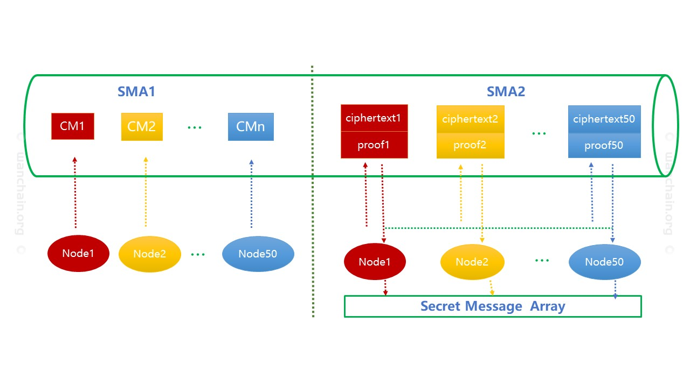
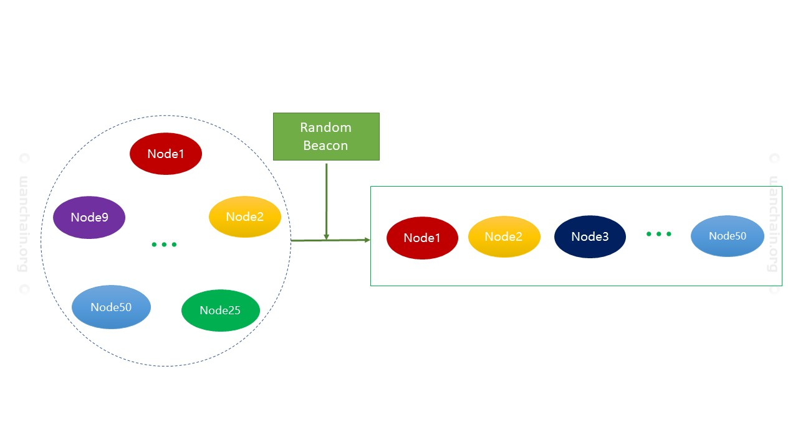
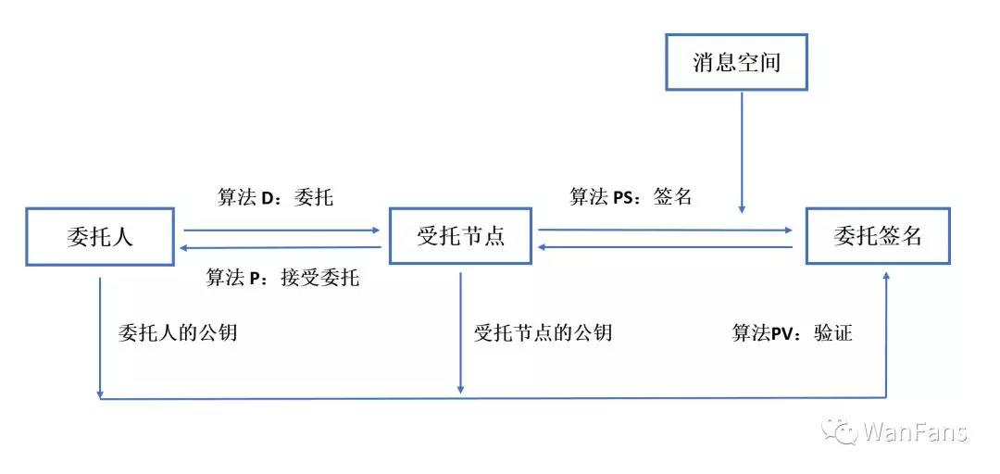
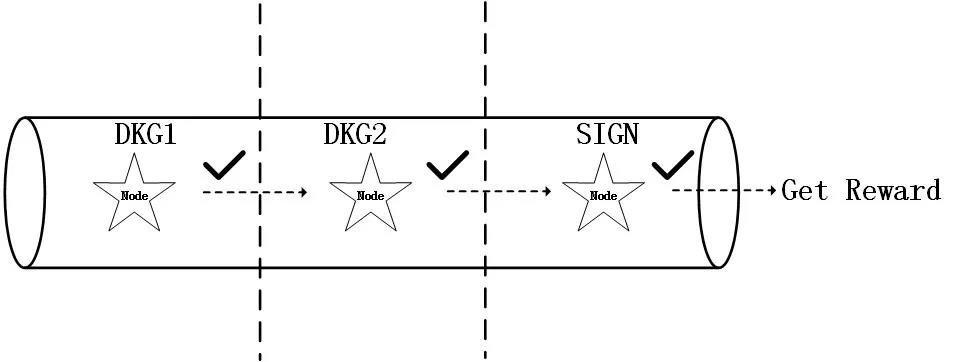
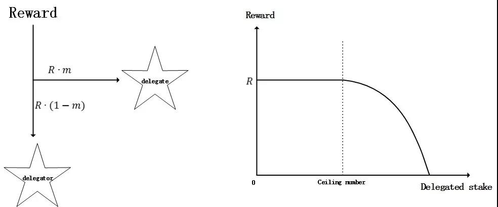

# Wanchain星系共识深入解读

## 第一章 整体架构与流

星系共识（Galaxy Consensus）是万维链理论研发团队全新提出的高效、科学、安全的实用型PoS共识协议，旨在替代原本高能耗的PPoW（permission proof-of-work），也将万维链的共识系统正式开放给广大社区，迈出完全去中心化的关键一步。在当前众多区块链系统百家争鸣的形势下，安全高效的共识协议已经成为大家主要的研究方向之一，PoS、PoA、PoI等等众多共识模型被相继提出，而在众多共识模型中，经过谨慎的思考，万维链认为权益才是左右链上治理和发展的根本因素，也就研发了PoS星系共识协议，在群星璀璨的共识节点运转下，打造属于万维链的共识星系。

### 一、整体框架设计
对于共识协议的设计来讲，主要解决的就是两个核心问题：出块者选择（Leader selection）和合法链选择（Chain selection）。在传统的PoW中，出块者的选择是通过挖矿进行的，借助的是哈希函数的随机性，矿工依赖自身的计算能力参与出块者竞争，而这里的公平性就体现在任何节点对哈希函数结果的不可预测性，任何节点都没有优势可言，只能通过简单粗暴的穷举运算来解决问题。合法链的选择上往往也是采取最长链的规则，也就是让算力最大的分支成为主流。这样挖矿+最长链规则的框架设置下就导致了大量的能源浪费，也是其他共识协议被提出的根本原因之一。那么当前主流的PoS协议又是通过怎样的框架设计来解决这一问题的呢？

经过长期的调研学习，我们以三种知名的共识协议来简单介绍PoS共识的主流框架：

Cardano的Ouroboros是发表在美密会上的顶尖学术论文，也是第一个被工业界采用的可证明安全PoS算法，其卓越的贡献就在于提出了可证明安全的共识模型框架，并在其中设计了实用的算法模块。在其多个系列版本中，出块者选择上也有不同的方式，由最初利用随机数的确定性选择到采用VRF算法的匿名选择，Ouroboros逐渐将选择的过程隐私化安全化，而有效链的选择上一直是最长链规则，也就是chain based方式，保证了链的安全性。所以Ouroboros的整体框架就是VRF selection + Chain based模式。

Algorand是由图灵奖得主、MIT教授Sivio Micali提出的PoS共识协议，其突出贡献在于设计了BFT的升级协议BA\*协议，利用投票的方式解决了区块合法性的选择，在出块者和验证者的选择上Algorand也采用了VRF算法，保证了随机性和匿名性，经过BA\*协议的运行，保证每一个高度的区块都是被确认的，即使最终是空区块，也是经过投票认证的。所以Algorand的整体框架就是VRF + BA*投票模式。

Casper是以太坊当前研究开发的PoS共识协议，秉持着实用性的特点，Casper采用了投注式共识，完成保证金质押的验证者可以投注自己相信会被确认的区块，在投注规则的限制下保证了最终胜出区块的唯一性，而胜出的验证人也将得到收益。Casper将帮助以太坊由PoW转型为PoS，也是大家十分期待的共识协议。所以Casper的整体框架就是验证人 + 投注的模式。

简单介绍了几种主流PoS共识协议之后，我们回归到星系共识，经过深入的思考研究，星系共识坚持学术派的发展路线，借鉴了Ouroboros可证明安全的模型框架，全新设计更加高效安全的随机数生成算法，并创新性设计Unique Leader Selection算法替代VRF算法，用于出块者选择，保证了合法出块者的唯一性，大大降低了自然分叉概率，所以星系共识的整体框架就是ULS + Chain based，在保证安全性的前提下极大地提升了实用性。

### 二、两类星体，代表两种共识节点角色

在星系共识之中，所有在智能合约中质押了WAN的用户都将成为整个星系中的一个节点，而这些节点由于能力的大小被分为两种星体：验证节点，即恒星（star）和委托人，即行星（planet）。
 
为区分两种星体，这里就不得不说星系共识中的委托机制，为了给仅持有少量WAN或权益较小的用户提供参与共识的机会，在星系共识中我们设计了完整的委托机制。委托机制的实现是基于三重ECDSA委托签名算法，对当前的区块链系统有着天然的兼容性，通过委托机制，持有少量WAN的用户可以将自身权益委托给代理节点，由代理节点参与共识的运行，同时由于签名消息空间的限制，代理节点只能代为出块，无法进行其他操作，保证了用户权益的安全性。
 
了解了委托机制，就可以介绍两种星体的不同。在星系共识中的两类星体：

恒星节点：是可以接受委托的共识节点，其自身持有一定量的权益，而且其自身权益值将影响其接受委托的权益上限；

行星节点：是不可以接受委托的共识节点，其参与共识完全依赖于自身持有的权益值。
 
虽然两种星体能力大小有所区分，但在参与共识的过程中是相同的，并不做区分。希望成为恒星节点，一方面需要更多的权益质押，另一方面也取决于节点的信誉程度，最终方法后续将有详细说明。
 
### 三、两类星群，负责构建链上随机数和收集交易、打包出块

星系共识之中，参与节点由于任务分工被划分为两个星群：RNP星群和EL星群。这两个星群都是在所有星系共识节点中，按照自身持有权益比例选择出来的。但是承担的任务不同，主要解决了共识中的两个关键问题：
 
RNP星群是负责构建链上随机数的群体。RNP星群中的节点通过DKG1、DKG2、SIGN三个阶段的工作完成随机数的更新，保证了链上随机数的安全性。正如上面介绍的主流PoS框架所说，如何维护一个公平的随机数是保证协议安全的重中之重，RNP星群正是承担着这一关键性工作，其每一轮产生的随机数将作为星群构建、出块者选择和其他随机源应用的重要种子，维持着共识的健康运转。
 
EL星群是负责收集交易、打包出块的群体。EL星群需要完成两个周期的工作，第一个周期通过SMA1、SMA2两个阶段完成秘密信息序列（secret message array）的协商，完成EL星群内部秘密数据的共享，第二个周期通过秘密信息序列和链上随机数确定出块权归属，并在自身负责出块的时间段内打包区块并广播，完成链的生长发展，其作用毋庸置疑，是保证共识安全运行的基础。
 
### 四、星系共识运行流程

介绍了两种星体和两类星群之后，我们从一个较高的视角整体的描述星系共识的运行流程，给大家一个直观的展现，看看星系共识是如何运行的。首先我们介绍两个时间上的概念：slot和epoch。相信了解过Ouroboros的读者对这两个概念应该并不陌生，slot是一个区块的生成时间，即每个slot内产生一个新的区块；epoch是由大量连续slot构成的时间周期，是协议完整运行的一个循环。下面分四个步骤讲述协议运行流程：
 
**1. 构建星系**

这是协议运行的准备阶段，在这一阶段，所有想要参与星系共识的节点通过在共识智能合约中质押一定量的WAN成为星系节点，质押时会选择锁定时间，这一时间将影响节点的权益值，锁定时间越长，权益值则相应略高，同时权益值随着锁定时间的流逝也将呈增长趋势，这一设计很好的模拟了币龄的概念，确保了权益设计的合理性和节点参与的公平性。经过这一阶段的准备，星系中就出现了大量的节点，这些节点将正式运转星系共识。
 
**2. 组建星群**

在每次协议运行周期（epoch）的起始，星系中会选择出两大星群，即RNP星群和EL星群，这两大星群的选择是基于节点持有权益值的比例，利用链上随机数进行的随机选择过程，类似于follow-the-satoshi，这里我们使用follow-the-stake-ratio，保证了星系节点参与组建星群的公平性，权益占比越高，被选入星群的概率越大，参与共识进而获得收益的可能性就越大，这也是PoS共识的核心思想之一。
 
**3. RNP星群运转**

RNP星群被选择组建之后，星群中的节点完成DKG1、DKG2和SIGN三个阶段的工作，在DKG1阶段，各节点提出自身对随机数碎片选择的承诺，保证了碎片选择的不可更改性，在DKG2阶段，各节点将自身选择的随机数碎片通过门限秘密分享的方式分享给星群中的其他节点，最终在SIGN阶段，各节点公布自身收集的随机数碎片数据，完成随机数的生成，更新链上随机数数据。整个过程由于门限秘密分享的特点，保证了只要在线节点数超过门限值就将顺利完成随机数的更新，确保了随机数生成的可靠性，同时只要星群中至少一个节点在随机数碎片的选择上是随机的，那么最终随机数结果就是随机的，保证了随机数生成的安全性。
 
**4. EL星群运转**

EL星群被选择组建后，将参与两个周期（epoch）的工作。在第一个周期中，EL星群节点参与SMA1和SMA2两个阶段工作。在SMA1阶段，各节点提出自身秘密信息的承诺数据，保证了秘密信息的不可更改性，在SMA2阶段，各节点将自己的秘密信息加密共享给其他节点，完成秘密信息序列（secret message array）的生成。在第二个周期起始时，EL星群中的节点会依据RNP星群产生的随机数进行排序，这一排序在整个周期中有效，同时依据秘密信息序列执行出块者选择算法，确定整个周期内各时间段（slot）的出块权归属，这一过程是在EL星群内部秘密执行的，其他节点无法获知结果，而EL星群中节点就依据出块权的归属完成整个周期内新区块的生成。当新区块被提出时，EL星群中的节点要添加自身合法性的凭证，这一凭证可被全网验证，确保了链的正常安全发展。通过以上的介绍了PoS星系共识的整体框架和运行流程。其中更详细的内容，可以在星系共识论文中找到具体的描述。
 
以上简单介绍了星系共识的整体框架和运行流程，详细内容在星系共识论文中有着具体的描述，在后续的星系共识探索中我们会再深入介绍其中各模块组件的设计思想和运转流程，为大家逐步呈现星系共识系统的完整蓝图。

## 第二章 随机数生成算法

在上一篇解读文章中，我们介绍了星系共识的整体框架和流程。在共识过程中，节点会组建成两大星群——RNP星群和EL星群，前者负责随机数的生成，后者负责打包交易提出区块。本文将深度介绍星系共识的随机数生成算法以及其所具有的优势和对共识协议运行的重要作用。
 
### 一、随机数对于区块链系统的重要作用

在正式谈随机数的作用之前，我们需要了解一个概念，那就是“熵”（entropy）。熵对于物理学领域的朋友一定不会陌生，它是体系混乱程度的度量。在1948年，香农（Claude Elwood Shannon）提出了信息熵的概念，去描述信源的不确信度。简而言之，熵就是不确定性的度量。举一个简单的例子：“北京明天的天气状况”，可能是晴天，也可能是阴天或者下雨，结果是不确定的，因此熵为正数；“地球明天要毁灭”，我们知道地球明天不会毁灭，这是确定的结果，因此熵为零。

（此图来自网络，侵删）

那么熵和区块链系统有何关系呢？可以说，熵对于区块链系统是至关重要的，是整个系统运行的安全保障。以比特币系统为例，它采取PoW作为共识算法，矿工进行大量哈希计算去争夺出块权，任何高度区块的出块者身份都无法提前预测，这就是熵在比特币系统中的体现。试想如果熵为0，即每个区块的出块者都是事先确定的或者人为可控，那么必然会出现合谋、分叉等攻击。因此任何区块链系统都需要一种安全有效的方式为系统引入熵。基于PoW共识的区块链系统由于挖矿的随机性，以天然的方式为系统引入了熵，然而对于PoS和DPoS共识的区块链系统，就需要单独设计一种方式去引入熵，那就是随机数生成算法。可以说随机数生成算法是设计共识机制的主要挑战之一，也是衡量共识机制优劣的重要标准之一。
 
### 二、随机数生成算法优劣的衡量标准

既然随机数生成算法这么重要，那么一个好的随机数生成算法应该是什么样子呢？从安全和实用角度而言，它应当满足以下六大性质：

- 去中心化（Distributed）：随机数的生成过程要是去中心化的，不能依赖或者借助可信第三方完成。
- 不可预测（Unpredictable）：根据历史产生的随机数或其他信息无法预测未来的随机数，这是“随机”的基本要求。
- 无偏性（Unbiased）：任何人都无法通过计算能力或者后发优势去针对性左右随机数的生成结果。
- 均匀分布（Uniformity）：输出的随机数在其值域内是均匀分布的。
- 保证输出（Guaranteed Output Delivery）：随机数生成算法的参与者无法通过违背算法的方式使得无法输出随机数，即必然会有随机数输出。
- 公开可验证（Publicly Verifiable）：没参与随机数生成的节点可以以后验的方式，监督协议的执行，验证随机数是可信和无偏的。
 
以上六大性质对于随机数生成算法至关重要，违背其中任意一条都可能会导致严重的安全漏洞。据区块链安全公司PeckShield披露，EOS上有超过8个竞猜项目遭受黑客攻击并获利几百万美元，严重威胁到了EOS正常生态秩序，而大部分攻击成功的原因都与随机数生成漏洞有关。我们以EOS.WIN项目为例，剖析其随机数算法漏洞根源。

EOS.WIN支持的一个游戏是猜数字，即用户输入某个数字并压大或者压小，然后系统随机生成一个数字，如果用户压对大小，则视为中奖并获取收益。显然如果能够控制系统随机生成的数字，就可以左右游戏的结果。而决定EOS.WIN系统随机数生成的因素为交易哈希ID、成交区块高度、成交区块前缀、全局开奖序号等。其中成交区块高度、成交区块前缀虽然是未来某区块信息，但是在实施过程系统指定使用当前同步到的最新块信息，因而是确定的；同时，交易哈希ID能够通过交易内action结合块信息预先计算。于是随机数的生成仅依赖于全局开奖序号了。攻击者利用不断制造错误交易，造成交易状态回滚，控制全局开奖序号，从而控制随机数的生成，直到中奖。显而易见，EOS.WIN的随机数生成算法不满足上述的第二条性质（不可预测性）和第三条性质（无偏性），因此存在漏洞，最终被攻击者有效攻击。
 
### 三、星系共识随机数生成算法
 
星系共识中的RNP星群借助承诺、零知识证明、门限秘密分享、门限签名、椭圆曲线序对等多种密码学手段，实现了安全高效的随机数生成算法，为整个共识过程安全提供了数据基础。为了能够形象介绍随机数生成算法的设计初衷以及其精妙之处，我们将其类比一个简单的游戏：

纸牌游戏： Alice和Bob玩纸牌游戏，两人分别秘密选一张扑克牌放在桌面下方，选定之后，同时将纸牌亮在桌面上。如果两张纸牌的点数和为偶数，则Alice获胜；否则，为Bob获胜。

这个游戏看似简单，但是在区块链上公平的进行并不容易，要通过多种手段防止Alice或者Bob作弊。我们接下来一步一步分析：
 
问题1：Alice和Bob选定之后就不能再更换扑克牌，否则就可以根据对方扑克牌的点数决定自己扑克牌点数，从而获取胜利。例如，Alice如果可以更换扑克牌，那么只要保证自己所选扑克牌和Bob的扑克牌点数具有相同奇偶性，那么点数和总为偶数，Alice便可以获胜。
 
星系共识通过使用“承诺”（Commitment，在配图中用CM指代Commitment）的方式来保证不会发生以上作弊行为。“承诺”是一种密码学工具，能够保证在不暴露原始数据的基础上，将其进行“证据留存”，它和明文是一一对应的，任何人都可以验证二者的对应关系是否成立。

结合我们的例子形象理解就是，Alice和Bob将自己选定扑克牌撕一个小角下来，放在桌面上，这个小角不会暴露扑克的点数，而且只与撕坏的另一部分才能够拼接为一张完整的扑克牌。在星系共识协议中，这是Random Beacon的DKG1（Decentralized Key Generation）阶段，每个RNP（Random Number Proposer）节点计算其所选数据的承诺并发送到链上进行存证。
 

 
问题2：Alice和Bob在选好扑克牌之后，在正式亮牌之前要对自己的扑克牌保密，不能让对方看到。同时在亮牌时候要证明这张牌确实是之前选定的牌，而不是新选的另一张牌。
 
星系共识通过公钥加密算法加密原始数据，之后将加密结果发送到链上，保证了数据的机密性；同时使用零知识证明保证上链的加密数据与承诺完全匹配。结合我们的例子形象理解就是，Alice和Bob将被撕过角的牌从桌下取出，扣在桌面上，并且二者都验证扣在桌面上的牌与之前放在桌上的小角能够拼接为一张完整的纸牌。在星系共识协议中，这是Random Beacon的DKG2阶段，每个RNP节点将其给其他节点的数据通过对方公钥加密之后发送到链上（下图中S1，S2，Sn为经公钥加密后的链上数据），同时发送到链上的还有DLEQ-Proof（非交互零知识证明），用于证明加密内容与承诺CM是匹配的。这个阶段之后，所有节点都可以从链上获取其他节点发送的数据，并且在本地解密为明文。

问题3：开牌之后，需要计算两张扑克牌的点数。我们要保证Alice和Bob都要计算出同一正确结果。这个问题看似很荒唐，但是却非常重要。因为某位玩家可能会装疯卖傻，故意计算错数字，从而降低游戏进行的效率。
 
星系共识通过使用分布式密钥生成的算法解决了问题3，即所有RNP节点通过交互生成一个共同的组密钥（group secret key），这个密钥不会完整出现，而是分割为密钥碎片，每一个RNP节点掌握一个密钥碎片。之后，RNP节点能够合成组密钥签名，而签名的哈希值即为最终的随机数输出。由于组密钥是公共确定的，因此组密钥签名也是唯一固定的。结合我们的例子形象理解就是，Alice和Bob会计算得到共同的点数。

 
问题4：此时，无论是Alice还是Bob都不能够终止游戏的进行。也就是一旦游戏开始，就一定要正常结束，不能因为某一玩家拒绝配合游戏规则而导致游戏流产。
 
星系共识通过门限签名的方式解决了问题4，即只要超过门限值数量的RNP节点参与计算，就能够合成组密钥签名。个别RNP节点拒绝参与计算并不会影响结果的生成。结合我们的例子形象理解就是，即使Alice不想亮牌，Bob也有能力将两张牌亮出，从而完成游戏。
 
以上过程对应于星系共识协议中Random Beacon的SIGN阶段，在这一阶段中RNP节点合作生成组密钥签名并计算得到随机数输出。

现在我们把上述过程梳理一下：1. Alice和Bob扑克牌的点数之和是二者共同决定的；2. 每一局游戏的点数和都是独立的，不存在相互依赖的关系，因此历史游戏数据没有预测作用；3. Alice和Bob都无法提前知道对方的扑克牌点数，因此没有后发优势去左右点数之和；4. Alice和Bob可以选择任何一张扑克牌，因此点数分布是均匀的；5. Alice和Bob都无法中断游戏的进行；6. 任何第三方都可以对游戏过程进行审计，因为所有数据都在链上存证。
 
由以上分析可知，星系共识的随机数算法满足前文提到的六大性质，是安全高效的随机数生成算法。
 
本次对星系共识的随机数生成算法的解读到此结束，相信您已经有了更加深刻的认识。下次我们将对星系共识的Unique Leader Selection (ULS)算法进行解读。

## 第三章 出块者选择算法

之前，我们介绍了星系共识的整体架构和流程以及星系共识的随机数生成算法。在共识过程中，节点会组建成两大星群——RNP星群和EL星群，前者负责随机数的生成，在上一篇文章中已进行了详细而形象化的介绍，后者负责打包交易提出区块，而这一工作的核心难点就是解决出块者选择问题，本文将深入介绍EL星群中出块者选择的流程原理和重要作用。
 
### 1. 合理出块者选择的重要意义

在我们第一篇文章中讲述到，在区块链共识协议中要解决的两个核心问题是出块者选择（Leader selection）和合法链选择（Chain selection），无论在哪种共识协议中，合理的出块者选择都是重中之重，我们设计随机数生成算法引入熵的一个关键作用就是要用于出块者选择。

合理的出块者选择对保证链的安全性和活性至关重要，一个好的出块者选择算法是共识健康运行的基石。我们先说说出块者选择对链安全性的意义，链的发展延长本质上就是块的不断接续，而完成打包提出区块的就是这些出块者，他们一方面决定哪些交易写入区块进而上链确认，另一方面也通过选择接入的父区块决定着链的发展走向，在网络中共识节点善恶并存的环境下，一个好的出块者选择算法就是要保证诚实节点能够获得更多的出块权，进而主导链的发展。当然，不同的共识协议在不同的安全假设之下，出块者选择算法的设计也是不同的。

- 工作量证明（PoW）的安全假设：50%以上算力安全

在这一安全假设下，PoW采用hash运算的方式进行出块者选择，即节点通过大量hash试算来寻找解决难题的随机数据，也就是挖矿，这一过程中由于hash函数运行结果的不可预测性，任何节点在hash试算上不存在优势，是纯粹算力的竞争，而50%以上安全算力就保证了出块者中大部分是诚实节点，进而保证了链的安全性。

- 类BFT协议的安全假设：2/3以上节点安全

在这一安全假设下，类BFT协议通常采用轮流坐庄或概率选择的方式进行出块者选择，无论采用哪种方式，都必然能够保证诚实节点获得多数出块权，同时要求共识网络中节点必须对提议的区块进行投票，只有获得了2/3以上投票的区块才算最终合法区块，进而保证了链的安全性。

- 权益证明（PoS）的安全假设：50%以上权益安全

在这一安全假设下，PoS协议通过依据节点权益持有量比例随机选取出块者，而这一选择的关键就在于随机性的安全性，保证了随机源的安全就保证了在大量出块者选择过程中诚实节点能够获得多数出块权，进而主导链的发展，保证了链的安全性。

上面通过介绍常见共识协议在不同安全假设下出块者选择的设计方法，当然也有特殊的混合模式，这里不进行详细论述。由上可见，合理的出块者选择对保证链的安全是极其重要的，我们可以用一个简单的反向例子来直观理解，如果在比特币挖矿中，某个恶意节点找到了挖矿的窍门进而获得了半数以上的出块权，那么他就可以任意的重构链来实现双花等攻击，任何一笔交易都将不再可信，这将是对比特币生态系统的毁灭性打击。

我们再来简单说说出块者选择对保证链活性的重要意义。对于活性的定义在不同的解读文章中都有论述参考，我们简而言之，就是链可以持续稳定的发展延长，有效合法的交易经过一段时间可以得到确认。出块者本就担负着链发展建设的重任，很显然他们就是保证链活性的主体，有很多共识模型（如Snow White）对于如何保证链活性都有深入的研究和探索。总体来说，要保证链活性，需要解决两个问题：一是保证出块者活性，被选中的出块者要是活跃的，积极参与共识过程的，而不能是离线或者休眠状态，进而导致大量区块的缺失，影响链的正常发展；二是保证节点间数据一致性，诚实节点必然能够接收到有效合法交易，并诚实的将其打包进入区块上链确认。加上上面对安全性的论述就能保证链的活性。而出块者的活性就要由出块者选择来保证，这一选择是一个广义的概念，并不一定狭义的体现在具体选择算法之中，而是在整体的设计理念里加以考虑，Wanchain的星系共识中对此进行了着重思考，并通过权益概念的全新定义、委托机制的设计和奖惩机制的刺激妥善解决，我们在此不做详细说明，后续解读文章将具体解释。

### 2. 出块者选择算法需要考虑的几个问题
 
上面介绍了出块者选择算法的重要性，那在设计一个出块者选择算法时应该重点考虑哪些问题呢，或者哪些性质才是评定一个出块者选择算法好坏的衡量标准呢？

1.公平性：出块权是依据共识节点资质均衡分配的。例如PoW中算力越高，获得出块权的机会越大，而PoS中权益持有量越大，获得出块权的机会越大。这是一个很自然合理的性质，但它的外延很广，出块者选择就像博彩，想要实现真正的公平性也需要规避很多问题，我们以一个例子来说明：假设A和B是两个共识节点，通过掷骰子的方式决定谁是出块者，点数为奇数则A获得出块权，为偶数则B获得出块权，公平条件下，骰子是被“上帝”掷出，A和B的机会各一半，而如果A获得了掷骰子的权利，那么公平性就被打破了，他可以多次试验甚至直接摆出奇数点数来霸占出块权，进而独自决定链的发展甚至肆意进行攻击，这是十分可怕的。

2.可验证性：出块权的合法性是可以被公开验证的。例如PoW中区块头hash值小于难度值可以被全网运算验证。这条性质是显而易见的必然要求，区块链作为去中心化的系统，其运行必然是接受全网监督认可的，区块的合法性验证是基本要求之一，而区块合法性除了交易合法性和结构的合法性外，出块者的合法性也是必须要被验证的一点，所以任何的出块者选择算法都必须保证出块权的归属是可以被正确验证的。

3.匿名性：出块者通过匿名方式隐私参与共识。这条性质并不是必然要求，之所以提出是因为匿名性可以解决共识中可能出现的安全风险，如腐蚀攻击。具体来说，如果出块者在其出块权归属时间之间被全网所知，那么恶意节点有可能通过贿赂等方式将其腐蚀，把原本的诚实节点变成恶意节点，进而进行攻击，甚至直接进行网络攻击导致出块者掉线，这就增强了恶意节点的攻击能力或削减了诚实节点获得的出块权，所以实现匿名性对于共识协议来说也是一个需要考虑的问题，很多项目（如Dfinity、Algorand）大多采用VRF算法来实现匿名性，但VRF也存在其自身的缺陷和弊端，现在也有项目（如Ouroboros Crypsinous）提出使用零知识证明进行匿名共识，但还没有具体实现。
   
### 3. 常见的出块者选择算法
 
介绍过出块者选择算法的重要意义和衡量标准，我们简单列举三个典型的算法来具体了解一下当前常用的出块者选择方式：

**- 算力竞争**

算力竞争的方式是区块链系统里最早使用的出块者选择算法，最典型的就是比特币系统，是比较简单粗暴又直接有效的方式。共识节点打包交易后，通过不断调整区块头中的随机数来反复运算区块头的hash值，当hash值小于当前区块要求的难度值时就形成了符合要求的合法区块，此时就获得了出块权，成为一名合法的出块者，也就是完成了整个挖矿过程。这种方式的好处就是对于所有参与节点都是公平的，任何节点不会在hash运算上取得优势，只要总体算力超过一半是安全的，那么链就是安全的。同时，这种方式在同一区块高度可能存在多个合法区块和合法出块者，会出现短暂分叉，这也是比特币系统需要等待确认时间的原因。目前来看这种出块者选择算法是共识协议中去中心化程度最高的，当然随着技术的发展和研究的深入，挖矿也从最初的CPU挖矿逐步发展到GPU、ASIC挖矿，算力增长迅速，很多项目为抵抗芯片挖矿通过增加存储要求设计了新的共识协议，如Zcash的Equihash。

**- Verifiable Random Function（VRF）**

VRF用于出块者选择算法是为了解决匿名性而提出，具体方式是先设置一个合理的阈值，节点利用自身的私钥对某一随机数据进行运算（如签名），得到的结果小于设置的阈值则为合法出块者，获得出块权。这一过程中由于私钥运算只能节点自身进行，保证了其他节点不能获知出块权归属，而计算结果如签名结果可以被公开验证，确保了出块权合法性可以被验证，形成了完整的出块者选择过程。显然，这种方式是概率性的，若想某一区块高度可以有尽量多的合法出块者，就需要尽量提高阈值，反之想要某一区块高度可以有尽量少的合法出块者，就需要尽量降低阈值，这对阈值的设置就有极高的要求，同时对私钥运算结果的分布也要有较好的预期，这往往是很难做到的，就容易出现某一区块高度有大量合法出块者而形成密集分叉，某一区块高度没有合法出块者而形成空白，所以VRF算法虽然解决了匿名性问题，但在具体使用中仍然存在难以避免的问题。

**- follow-the-satoshi**

follow-the-satoshi是PoS中常见的一种出块者选择算法，具体方式是将所有的代币进行排序编号，通过一个随机源产生一个随机数，这个随机数落到了哪个代币的编号上，那么这枚代币的持有者就是合法的出块者，获得了出块权。这种方式显然是唯一确定性的，难点就在于如何找到一个安全的随机源来产生真随机数。Cardano项目当前就采用了follow-the-satoshi的方式进行出块者选择，其随机数的生成使用了多方计算、门限秘密分享等多种密码学技术，保证了随机源的安全性，但在出块者选择的匿名性上还没有实现。但就随机数生成而言，另一种方式就是使用链上的某段历史数据的hash值，其中以Algorand为代表，将之前某个区块的数据和当前区块高度进行混合运算hash值作为随机数，算是一个较好的伪随机源，但仍有被刻意控制的风险。关于随机数的生成和相关性质这里不再过多论述，感兴趣的读者可以参考上一篇解读文章。
 
### 4. Galaxy ULS算法原理流程
 
兜兜转转介绍了这么多，最后还是要回到我们的主题，Wanchain星系共识的出块者选择算法——ULS算法，ULS代表的是uniqueleader selection，即唯一出块者选择，ULS算法在设计之初就考虑到了公平性、可验证性和匿名性，采用了秘密分享、零知识证明等多种密码学手段，实现了固定时间窗口内的唯一合法出块者的匿名选择，在保证链安全性的基础上，尽量降低短分叉几率，提升共识效率，下面我们就形象化介绍星系共识ULS算法的整体原理流程。

**- a. EL星群选择**

EL星群节点是运行ULS算法的主体，那我们就从EL星群的来源说起，在星系共识的第一篇解读中有简短介绍，这里我们再进行一次详细说明。在PoS协议中，话语权由权益持有量决定，而我们将这一对应关系在EL星群的选择过程中进行实现。基于Wanchain共识合约中当前Committee的质押状态，可计算每个节点的权益值和其权益比例，利用RandomBeacon提供的随机数，运行follow-the-stake-ratio算法，类似于follow-the-satoshi的过程，形象地说，就是Committee中节点按照其权益比例划分了一块钟表的表盘，每个节点拥有一段与其权益占比相同的时间窗格，然后随机数就是拨动时间指针的上帝之手，指针落到哪个时间窗格，此窗格的拥有者就被选入EL星群，每轮选择独立进行，某一节点有可能被多次选入，所以最后EL星群有可能是一个多重集，选出的EL星群将肩负起运行ULS算法的责任。

 
**- b. 秘密消息序列（Secret MessageArray）生成**

EL星群被选择组建之后，需要先进行一次链上的通信协商，这一过程是为了在星群内部生成一个秘密消息序列，用于后续出块权分配，是我们实现匿名性的关键一步。为保证秘密消息序列不会被某些恶意节点控制，进而影响到后续算法运行，我们将这一过程拆分成两个阶段，也就是SMA1和SMA2。在SMA1阶段，星群中每个节点选择一个随机数，将其利用自身公钥加密后发送到链上，完成对随机数选择的承诺，保证任何节点选定的随机数在后续阶段不可更改。在SMA2阶段，星群中每个节点将自己选择的随机数用所有节点（包括自身）的公钥加密发送到链上，同时提供协调性证明（DLEQ proof），这里对照在SMA1阶段利用自身公钥加密的数据就可确保随机数并未更改，同时协调性证明保证了所有公钥加密的都是同一个随机数。这一阶段完成后，所有EL星群节点都可以自行解密，得到随机数据序列，也就是我们的秘密消息序列，准备运行出块权分配算法。

**- c. EL星群节点排序**

秘密消息序列生成后，随机数进行更新，新产生的随机数将作为种子对EL星群节点进行排序，具体方式就是将星群节点公钥与随机数接续进行hash运算，基于运算结果进行升序排列，这一排序结果将用于后续出块权分配。显然，排序是在秘密消息序列后基于新随机数进行的，任何节点无法影响，完全是随机的排序结果。

 
**- d.出块权分配**

在上述三项工作完成后，就可以为EL星群节点进行出块权分配。在之前的解读中我们说过，一组EL星群负责一个epoch内区块的生成，那么这个epoch内每个slot的出块权如何决定呢？首先将当前随机数和epoch编号和slot编号进行hash运算，运算结果取EL星群节点数量的模结果，如hash值是2019，目前EL星群节点数量50，取模结果就是19，那么EL星群节点排序中的第19位即被选为合法出块者，获得出块权。这一选择过程是等概率进行的，结合EL星群节点选择时的按权益比例进行，确保了出块者选择是按权益持有量合理进行的，确保了公平性；合法出块者在提出区块时需要提供合法性凭证，这一凭证可被公开验证，确保出块合法性的可验证性；合法出块者选择中使用了秘密消息序列，而这一消息序列只在EL星群内部共享，其他节点不可知，就保证了选择过程的匿名性。由此可见，ULS算法的是全面考虑了公平性、可验证性和匿名性的创新性设计，将对保证链的安全性和活性起到重要的积极作用。

 
以上简单介绍了星系共识的出块者选择算法——ULS算法，详细内容在星系共识论文中有着具体的描述，在后续的星系共识探索中我们会再深入介绍星系共识设计中其他的精彩内容。

## 第四章 委托机制

在前面文章中，我们介绍了星系共识整体流程和架构，以及两个核心算法，即随机数生成算法以及出块者选择算法。这两个算法能够保证在确定了共识参与者之后，共识过程能够安全稳定的进行。那么，如何才能够让所有的权益持有者参与到共识过程中呢？本文将详细介绍星系共识的委托机制。
 
### 1. 星系共识委托机制设计背景
 
当前区块链业界已经有了众多PoS共识机制，它们或由严谨细致的学院派提出，或由拥有丰富从业经验的产业界提出，但是都普遍缺乏实用性。体现在如下几点：

- 实际参与门槛较高

一方面，PoS共识协议虽不同于PoW对算力的高依赖性，但是也要求参与者节点有较好的计算能力和网络带宽，能够及时的完成协议内容，因此PoS参与者需要投入一定的硬件资源；另一方面，PoS的收益分配原则是“权益越大，收益越大”。二者相结合的结果就是参与PoS有较高门槛，即只有拥有较高权益的节点才会有足够的动力去参与PoS，拥有较小权益的节点则由于参与PoS的成本高于预期收益而被“拒之门外”。这个“门槛”虽不在PoS理论设计中，但是却是现实存在的。

- 中心化风险

由于参与门槛较高，只有较大权益拥有者可以参与到PoS共识过程中，从而获取共识收益。而获取的共识收益会加大共识参与者和非参与者之间的权益差距，陷入“富者愈富，穷者愈穷”的恶性循环，最终可能导致共识中心化的风险。

- 违背基础安全假设的风险

几乎所有PoS共识机制的安全基础为诚实大多数假设（honest majority assumption），即诚实节点占参与共识协议权益的大多数。这个假设对于整个区块链网络是成立的，但是如果共识参与门槛很高，只能吸纳一小部分权益参与到共识过程中，那么具体到PoS共识协议中这一假设就未必成立了。这本质上是一个取样问题，当样本量较小时，并不一定具有整体的统计特征。

因此，如何设计一种机制能够降低PoS参与门槛，尽可能吸纳更多的权益参与到共识过程中，对整个共识的实用性和安全性都具有重要意义。
 
### 2. 星系共识委托机制的意义
 
星系共识在设计之初就充分的考虑了协议的实用性。这个实用性不仅仅体现在降低共识过程中需要的计算和存储资源，更重要的是能够保证共识的参与者能够顺畅的参与到整个过程中。星系共识具有完整的委托机制，拥有较大权益的节点可以直接参与到共识过程中，而拥有较小权益的节点可以通过委托机制参与到共识过程中。理论上任何一个WAN的持有者都有能够加入到共识过程中，这是PoS协议的精神所在，也是星系共识实用性的体现。在这一方案下，更多的WAN会加入到共识中，从而使整个网络更加安全健壮。

因此，完整的委托机制降低了PoS共识参与的门槛，提高了星系共识的实用性，与其他PoS共识协议相比具有明显优势。
 
### 3. 星系共识委托机制的理论基础——委托签名（proxy signature）
 
委托签名是密码学中的一种特殊签名算法，它能够使一个个体，称为委托者或原始签名者（original signer），将自己对消息签名的权利委托给另外一个个体，即被委托者（proxy signer）。被委托者能够计算出一个委托签名，任何拥有原始签名者公钥的个体均可以验证签名的合法性。严格的说，委托签名算法为多个算法的集合，，其中 是一个标准数字签名算法（比如ECDSA），是委托和接受委托的算法，是委托签名生成算法，是委托签名验证算法。

### 4. 星系共识委托机制的流程
 
星系共识的委托机制是基于三重ECDSA委托签名算法（Triple ECDSA Proxy Signature）实现，这一算法由Wanchain理论团队设计提出，兼具通用性、安全性和高效性。同时结合智能合约，星系共识实现了完整的委托机制，使得任何WAN的持有者均可以加入星系共识中，维护网络安全，并获取共识收益。假设Alice为一名普通的WAN持有者，公私钥对为；Bob为一名星系共识的受托验证节点，公私钥对为；Proxy_SC为一个特殊智能合约，用于验证并存储委托过程中的相关数据。现在Alice要委托Bob去代替自己参与星系共识，具体流程如下：
 
Step1：Alice在本地将自己的私钥、Bob的公钥输入三重ECDSA算法中，生成委托证书

Step2：Alice构造一笔交易，将委托证书发送到Proxy_SC，同时委托资金锁定在Proxy_SC中

Step3：Proxy_SC验证Alice所发委托证书的合法性，并生成代理公钥和委托证书一同存储在合约中

Step4：Bob对Proxy_SC中存储的证书进行解析，利用自己的私钥计算得到代理私钥

Step5：代理公钥作为独立身份参与星系共识，Bob通过代理私钥完成共识过程，获取共识收益

Step6：共识收益按照委托约定，在Alice和Bob之间进行分配

Step7：委托期结束后，Proxy_SC将委托资金返还到Alice账户中

### 5. 星系共识委托机制的优势
 
**- 通用性**

星系共识的委托方案在标准签名、权利委托和委托签名中均使用ECDSA签名算法，这一算法也在区块链领域广泛使用。它与已有的区块链技术架构完全兼容。无论是直接注册加入到共识机制中，还是通过委托机制加入，对参与者出块的验证逻辑完全一致。

**- 非交互**

委托的过程是非交互的，因此委托者和受托节点之间不必建立安全的通信信道，完全通过链上交易完成委托，在共识过程中更加高效。

**- 高安全性**

已有的一些委托机制，往往需要委托者将资金转入受托节点账户，由受托节点直接参与共识，并完成收益分配。这种方式是中心化的，对受托节点诚信度要求较高，容易发生“携款跑路”的现象，对委托者资金安全产生巨大安全。星系共识的委托机制基于密码学算法实现，委托者的本金被锁定在智能合约内，受托节点只获得委托者的参与共识的权利，并不对用户资金具有任何控制权，因此能够充分保障用户的资金安全。

**- 公开透明**

星系共识委托机制中，委托的过程以及受托节点参与共识的数据都在链上进行存证，所有数据公开透明。一方面，保证受托节点能够公平分配共识收益，无法作恶；另一方面，也方便委托者能够对受托节点的活性进行甄别，从而选择合适的受托节点。

Wanchain项目的代币持有者足够分散，因此想通过资金回笼形成寡头垄断的局面相对困难。

## 第五章 经济激励机制

在上一篇解读文章中，我们介绍了星系共识的委托机制，委托机制的设计与应用是为了给少量权益持有者一个参与共识的机会，也是希望表现良好、性能优异的节点可以代表更多的权益发声。我们知道，一个区块链系统本身也是一个节点网络的生态系统，共识是维持生态系统正常运转和发展进步的驱动力，而什么是维持共识正常运转的源动力呢，那就是经济激励机制，本文将深入介绍Wanchain星系共识经济激励机制的设计原理、考虑和重要作用。
 
### 1. 经济激励机制的重要意义

经济激励机制是共识协议设计的核心部分之一，一个合理的经济激励机制之于共识协议就如同共识协议对整个区块链生态系统一样，有着极其重要的意义，它是激励共识节点诚实运转、抑制恶意行为的经济运行体系，是建立在技术基础之上的经济驱动力。
 
**狭义上看，经济激励机制是维持节点运行、保证链安全和链活性的基本保障。**

我们知道，对于区块链系统来讲，共识节点负责打包交易、生成区块，承担着链发展延续的重任，是保证链安全的关键，也是维护链活性的主体，所以在共识协议的设计过程中，大量的技术手段被反复研究和实践，核心目的就是要建立一个健康高效的共识运行体系。我们在前面的解读文章中从重要模块组件的角度入手，介绍了共识设计中的思想和原理，在技术上给出了形象具体的解释说明，但站在整个共识设计的外沿我们发现，其中有一个至关重要的问题我们还没有提及，那就是在这样的协议设计下，节点为何要参与其中，是什么驱使节点维护区块链系统呢？这就是共识设计中经济激励机制需要发挥的作用，它为共识节点注入了利益驱动力，让节点在运行共识协议的过程中获得经济奖励，这部分奖励需要覆盖节点维护运行的成本，同时需要有额外部分作为节点的收益，这样节点才可能在参与共识中有利可图，才会有意愿去维护系统的发展运行。一个好的经济激励机制设计，是鼓励共识节点诚实运行的正能量，它会将诚实节点的利益最大化，只有忠于协议的行为才会让节点收益最高，同时令恶意行为成为损害节点利益的原罪，如此从经济环境上营造协议健康运行的良好氛围，让共识节点积极主动的承担起保证链安全和链活性的职责，保障了整个系统的健康发展。
 
**广义上看，经济激励机制是区块链生态运转、承载价值流通的基础支撑。**

经济基础决定上层建筑，在整个共识协议的体系之中，经济激励机制起到了支撑性作用。当前，区块链技术正在推动信息互联网向价值互联网转变，以比特币来说，他的出现建立了一个去中心化的价值体系，将价值的定义摆脱中心化的控制，转换成共识意义下的价值存在。我们知道，价值重在流通，只有可以自由流通的价值才有其自身存在的意义，比特币中的经济激励机制是产出价值的源泉，节点通过记账工作获得价值，同时又在记账工作中完成了价值的传递和流通，这就让整个价值体系形成了完整的闭环，拥有了迭代延续的活力。由此可见，经济激励机制是推动区块链生态系统的动力之源，它激励着共识的运转，共识承载着价值的流通，而流通赋予了价值意义，有意义的价值再反补经济激励机制的运行，在这个完整的闭合流程中，经济激励机制既是起点又是中继，是整个价值体系的点火器和助燃剂，起到基础支撑性的作用。
 
### 2. 经济激励机制需要考虑的几个基本问题
 
说明了经济激励机制的重要意义，我们知道了一个好的经济激励机制是要鼓励诚实行为、抑制恶意行为，那么在设计中需要考虑哪些基本问题呢？

**哪些主体需要被奖励？**

显然，我们既然设计共识协议中的经济激励机制，自然是要奖励共识节点，然而在不同的协议设计下，共识节点的范围和外延也并不相同。
以比特币和以太坊为首采用工作量证明（PoW）共识协议的系统里，“挖矿”或者“矿工”是一个耳熟能详的概念，而这些节点之所以被称为“矿工”，是因为他们提供了算力进行hash运算，这样的共识中，只有这部分节点为共识做出了贡献，所以他们可以在每个自己提出的区块中给自己发放一定量的奖励，当然后续以太坊共识的开发中为了奖励那些虽然提出了合法区块，但最终却没被选中的区块提出者设定了“叔块”的概念，并给予了少量的奖励，以表示对他们工作的认可，这里不进行详细解释，感兴趣的读者可以参考V神的文章https://blog.ethereum.org/2014/07/11/toward-a-12-second-block-time/。

在Ouroboros和Dfinity等采用权益证明（PoS）共识协议的系统里，参与共识的就不仅仅是提出区块的这些节点了，我们在第2、3篇解读文章中都有反复强调，为了在共识协议中引入熵，必须要有一个可信的随机源，而采用某些历史数据的组合运算得到的只能是伪随机源，所以这里就需要有一组节点专门来产生随机数，这些节点的工作也是共识中必不可少的一部分，他们当然也就是需要被奖励的共识主体之一，也就是说，在这种类型的协议中，被奖励的主体有区块提出者和随机数生成者两类节点。

在EOS和Cosmos等采用拜占庭容错（BFT）共识协议的系统里，参与共识的节点需要为候选区块进行投票，只有获得一定比例投票的区块才会被确认合法，其中候选区块的提出也是由这些共识节点轮流负责或概率性选择进行，所以相对简单的，在这类共识协议中，需要被奖励的主体就是这些负责投票的节点。

**奖励来源，如何保证奖励的持续性？**

对于奖励的来源，一般分为两种。一种是类似于比特币，在系统运行初始时就设定好了奖励的总额，然后按照分阶段等比例递减的方式释放，在每个区块中自然添加固定数额的奖励，这也是“挖矿”说法的来源；而另一种往往在PoS的共识协议中出现，常是由基金会拿出一定量的初始资金用于奖励共识，这部分资金的释放也是采取分阶段等比例递减的方式进行。

显然，我们上面讨论的都是无增发状态下的奖励来源，我们不对增发奖励的情况进行讨论，因为没有依据的增发只会稀释奖励的价值，对整个生态系统的价值体系造成伤害。而上面的两种方式很显然是无增发的，这种情况下，在生态系统建立健全的过程中，价值是在无形之中被提高的，也就维护了价值体系的稳定。然而，我们可以看到，这种奖励是随着时间自然减少的，会不会出现运行时间越久，共识节点积极性越差的情况呢，这就是如何保证奖励的持续性。这个问题在设计中必然是要考虑的，除了调整奖励变动比例和变化周期等参数的方法之外，最重要的是，奖励除了上述固定来源之外，还有每个区块中包含交易的交易费，这些交易费是由交易发起方为共识节点记账工作提供的报酬，随着生态系统的完善、交易的增多、价值的增长，这部分报酬将逐步成为奖励的主体，成为支持共识运行的持续动力。

**如何保证奖励的公平性？**

谈到奖励的公平性，这是一个很宽泛的概念。我们在星系共识的黄皮书中提到经济激励机制的基本原则，第一条就是贡献越多、奖励越多，这是一个自然合理的要求。举例来说，如果节点参与共识，然而报名之后却什么工作都不做，既不在自己该提出区块时去打包交易构造区块，又不在自己该参与随机数生成的时候去完成信息提交，那么这种懒惰的节点显然就不应该被奖励，否则就是对其他兢兢业业完成工作的共识节点的不公平，所以在进行奖励的时候就要有一个评判的标准，要对节点参与共识的行为有一个评定，这也是我们在星系共识中提出活性系数的概念，依据活性系数，我们为积极完成好工作的节点提供应得的奖励，而那些消极怠工的节点将被扣除部分甚至全部奖励，这样就营造了一个公平合理的良性竞争环境，确保共识协议的健康运行。
如何在经济激励中权衡委托机制？

在上一篇解读文章中我们形象具体的介绍了星系共识中的委托机制，强调了完整的委托机制降低了PoS共识参与的门槛，对整个共识的实用性和安全性都具有重要意义。那么对于委托机制中的经济激励该如何设计呢？我们从委托机制的意义入手来思考这个问题，首先它是为了降低共识参与门槛，也就是给少量权益持有者一个参与共识的机会，相当于给自身的权益寻找代理，自己并不运行节点，那么他们就应该给被委托人提供代理的手续费用，所以我们设置了委托费率，这些委托人需要从获得的奖励中拿出一部分给被委托人，作为代理的报酬。同时，我们必须思考另一个问题，当被委托人接受了大量权益委托，这个时候虽然其自身持有的权益并不多，但他在共识中的话语权却很大，举例来说，如果一个被委托人自身只有10万的权益，却接受了100万的权益委托，那他在协议运行中就代表了110万的权益，这就带来了一个很直观的问题：这个被委托人可能愿意冒着自身少量权益受损的代价去做出恶意行为以企图获得更高的收益，这显然是我们不愿意看到的，所以我们在委托机制的激励中设置了“天花板”的概念，直观来讲就是为可接受委托额设置了上限，我们并不直接制止超过上限的委托行为，但是我们从经济激励中添加了控制的元素，简单来说就是，如果一个被委托人自身持有10万的权益，我们给他的被委托额度也将是10万，这就是“天花板”，在被委托权益值不大于10万的情况下，奖励是正常进行的，如果超过了这一额度，那么奖励将被减少，直至被委托值超过20万奖励被减少归零，我们希望通过正常的市场行为来调节委托机制的运转，既体现了委托的意义，又控制好安全的风险，在经济激励机制设计中做好对委托机制的权衡。
 
### 3. 常见的经济激励方式
 
说明了经济激励机制的重要意义和需要考虑的几个基本问题，我们来讲讲经济激励有哪些常见的方式。一般来讲，经济激励机制常有两种方式，即正向鼓励和反向抑制。

**正向鼓励，鼓励的是忠于协议的诚实行为。**这种方式比较直观也好理解，简单来说就是，对于那些按照协议要求严格完成自身工作的行为，我们会通过发放奖励的方式进行支持，例如，在星系共识中，参与并完成每轮随机数生成的RNP节点，我们给予相应的奖励，参与并完成秘密信息序列（SMA）共享的EL节点，我们给予相应的奖励，在自身负责的slot中打包交易提出合法区块的EL节点，我们给予相应的奖励，这就是正向的鼓励，是刺激协议良性运行的推动力。

**反向抑制，抑制的是不良企图的恶意行为。**这种方式都是出于保证安全性的考虑，希望能够从利益驱动角度消除作恶的动机。抑制的方式往往也有两种，一种是常见的slash，也就是惩罚，这种方式往往需要有一个监督的体系配合，需要有恶意行为的证据提交，再基于这些证据对节点恶意行为进行制裁，一般是通过扣除节点质押金实现，而怎样鉴定一个恶意行为是这里的难点，目前已经实现的有双签、长程攻击等。另一种抑制方式是降低出现恶意行为节点的收益，也就是我们在先前提到的只有忠于协议的诚实行为才能利益最大化，举例来说，在星系共识中，如果参与随机数生成的节点试图扰乱这一过程，在不同阶段提交不相协调的信息，那么这些信息将被排查出问题而无法上链，在奖励分发的时候，这些节点将得不到奖励，这样就抑制了这种恶意行为的出现，这种抑制方式的设计难点在于如何在奖励清算中去涵盖对恶意行为的考虑并有所体现，这将是一个需要持续深入研究的问题。
 
### 4. Galaxy经济激励机制模型原理
 
围绕经济激励机制介绍了这么多，最后回到我们的主题，Wanchain星系共识的经济激励机制，经过诸多考虑和研究，最终星系共识的经济激励机制实现了一个完整的闭环，我们相信将营造出一个良好的共识运行环境。

星系共识的奖励来源是由Wanchain基金会提供的WAN发行总量的10%，也就是2100万WAN，这部分资金也将分阶段等比例递减，在同一阶段内按epoch均分，当然每个epoch内所有交易费用也将计入奖励之中，这里并不按区块分发，而是每个epoch进行一次结算，交易费用计入奖励总额在RNP和EL节点间分配，这是基于交易费将逐步成为奖励主体而进行的考虑，以保证所有参与共识节点的利益。我们认为，在共识运行中，RNP和EL节点的作用与贡献是同等重要的，所以每个epoch结算中，奖励将在RNP和EL节点间平均分配，即如果每个节点都诚实运行，完成自身工作，那么获得的收益是相同的。下面我们分RNP和EL两个主体进行具体介绍，并将委托机制作为单独一部分说明。

**- RNP节点的经济激励**

前面我们反复强调共识协议中随机数的重要作用，也说明RNP节点必然是需要奖励的主体之一。对于RNP节点来说，工作逻辑相对清晰，如何鉴定其工作诚实完成也相对容易，首先我们来看RNP节点参与随机数生成需要完成的工作：在DKG1阶段提交承诺；‚在DKG2阶段提交加密数据和proof；ƒ在SIGN阶段提交签名碎片。而这三者是一个完整的过程，只有全部正确参与才算完成了随机数生成的工作，所以对于RNP节点来说，只有正确完成上面三项工作才能得到奖励，缺少或错误任何一项都拿不到任何奖励。

**- EL节点的经济激励**

类比于RNP节点，我们先梳理EL节点需要完成的工作：在SMA1阶段提交承诺；‚在SMA2阶段提交加密数据和proof，完成秘密信息序列共享；ƒ在自身负责的slot打包交易提出区块。显然可以按照工作内容切分为两部分，前两项为秘密信息序列共享，后一项是生成区块，所以EL节点的总体奖励中将拆分为两部分，一部分用于奖励秘密信息序列生成，另一部分用于奖励区块生成。与随机数生成类似，秘密信息序列生成的两个阶段是一个完整的过程，只有全部正确参与才算完成，所以EL节点只有正确完成这两阶段工作才能得到这部分奖励，缺少或错误任何一项都拿不到这部分奖励。而对于生成区块的奖励，我们加入了活性系数进行调节，将所有EL节点作为一个整体，依据epoch内最终区块数和slot数的比例均分这一部分奖励，群体活性越高，完成工作越好，得到的奖励越多，促进链的高质量生长。

**- 委托机制**

前面已经提到，在委托机制中，委托人需要从奖励中依照委托费率的比例拿出一部分交给被委托人作为报酬，剩余部分作为委托人参与共识的收益，而两者的奖励都受到被委托人当前接受委托值和接受委托上限的影响，当接受委托值超过上限，两者的奖励都将减少，直至最终归零。

