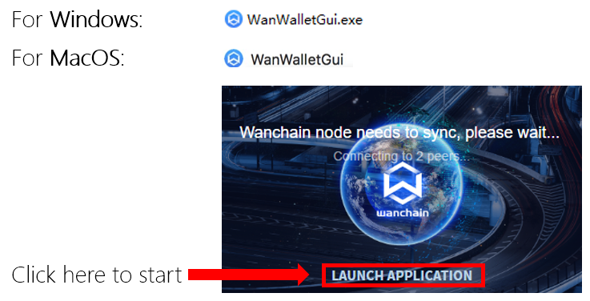
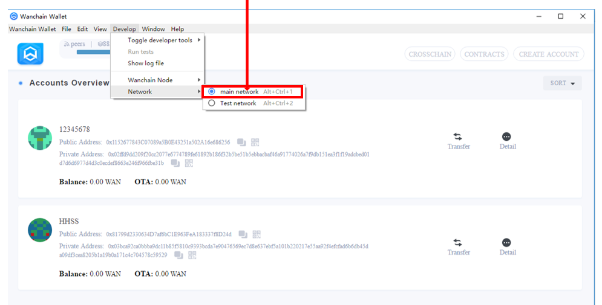
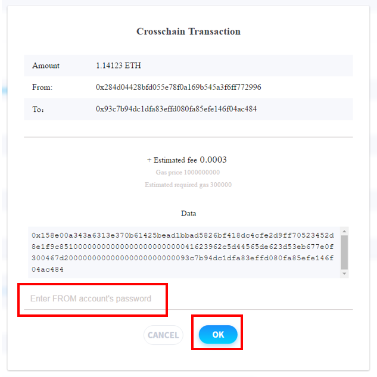
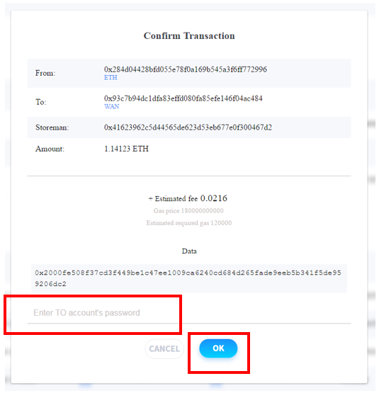
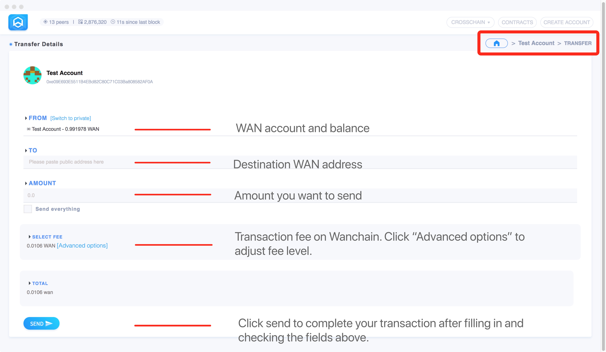
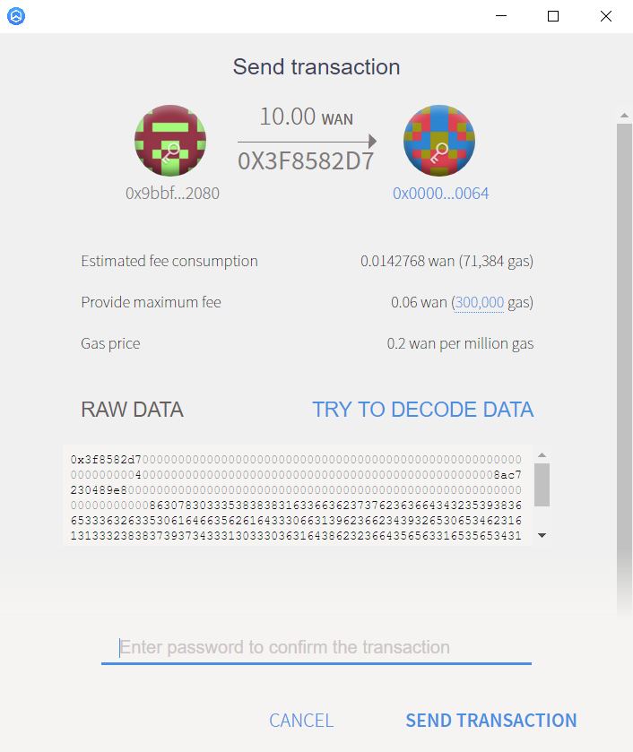
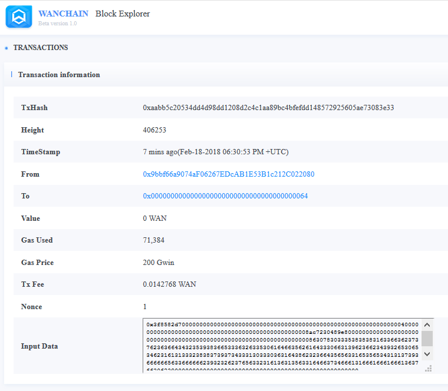
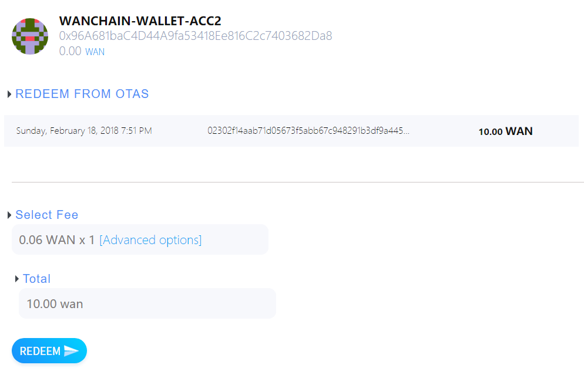

# Wan Wallet GUI全节点钱包使用指南

**本手册为万维链3.0 全节点钱包用户指南，相较于旧版本新添加了比特币与ERC20的跨链交易功能，所以强烈建议升级到最新3.0版本，并建议在升级前将Keystore文件进行安全备份。**

## 重要提示

随着万维链（Wanchain）3.0主网上线，万维链现支持与以太坊，比特币，ERC20代币的跨链交易。之前版本的万维链钱包在万维链3.0发布之后依旧能够正常运行，但3.0的新功能（例如比特币和ERC20的跨链交易）需要3.0或更高版本的万维链钱包才能运行，所以强烈推荐您升级到最新版本的万维链钱包。

对于旧版本的万维链钱包用户，虽然升级过程并不会以任何形式修改现有的keystore文件（秘钥文件），但为了避免出现任何数据丢失，强烈建议您**在升级钱包之前将keystore 文件（私钥文件）进行安全备份**。

本手册将着重讲解如何使用万维链钱包3.0发送BTC或ERC20代币到万维链上，或者从万维链上提取BTC或ERC20代币到比特币链上或以太坊链上。手册中以MKR（MakerDao的权益和管理代币）作为ERC20跨链交易的范例。请使用3.0或更高版本的万维链钱包，或访问https://www.wanscan.org/tokens ，浏览最新的ERC20代币支持列表。未来万维链钱包将会支持更多的ERC20代币。

实际上，3.0或更高版本的万维链钱包可以支持任意种类的ERC20代币，仅需万维链基金会提供相应的后端支持，无需用户和ERC20代币发行方进行任何操作。

用户可在万维链钱包中切换使用BTC/ETH/WAN的主网和测试网络。此版本的万维链钱包集成了BTC/ETH的轻钱包和WAN的全节点钱包。

## 第一章 万维链3.0钱包安装

#### 下载
在此链接下载万维链钱包3.0安装文件：https://wanchain.org/products

- 万维链钱包3.0支持**Linux**, **Windows**, **MacOS**, 请下载您操作系统对应的安装文件；
- 请检查安装文件的**SHA256哈希值**以验证您正在运行未经篡改的安装文件. 您可以在此链接找到钱包的下载地址，及其SHA256哈希值：https://wanchain.org/products

#### 安装与启动
解压或安装钱包安装包，运行，点击**LAUNCH APPLICATION**按钮来启动钱包。
	Windows:  
	MacOS:  

点此启动

	Linux:        
命令行安装: sudo dpkg -i WanWalletGui-linux64-3.0.XX.deb
使用主网启动钱包（命令行）: wanwalletgui                
使用测试网启动钱包（命令行）: wanwalletgui --network testnet
点击/usr/local/bin/目录下Wanwalletgui 图标启动
1.3 支持网络
万维链钱包3.0的BTC和ERC20跨链交易，在万维链、以太坊、比特币的主网和测试网上都能使用。可以随时通过点击钱包界面左上方的万维链图标访问钱包的万维链账户一览（默认的启动页面）。
1.4 主网/测试网切换
使用下图所示菜单项 (Develop--->Network) 来进行主网和测试网之间的切换。

术语解释
WBTC:  Wanchain Bitcoin Crosschain Token, 万维链上的比特币代币.
WMKR:  Wanchain MKR Crosschain Token, 万维链上的MKR代币. MKR是以太坊上一种ERC20代币
HTLC: Hashed Timelock Contracts，哈希时间锁合约

1.5 创建和备份账户
1）下图所示File下拉菜单中的3个选项可允许用户创建新的WAN、ETH账户，或新的BTC地址；
2）直接点击钱包界面右上角的 “CREATE ACCOUNT” 按钮仅能创建新的WAN账户；
注意：万维链钱包中的所有BTC地址都应使用相同的密码 (与第一次使用万维链钱包创建BTC地址时的密码相同)
 

3） 用户也可以使用下图框出的导入功能导入已有WAN或ETH账户的钱包keystore文件（私钥文件）
4）备份功能（Backup）则会打开本地WAN或ETH keystore文件（私钥文件）的文件位置，或BTC钱包数据库的文件位置
 
第二章  比特币跨链交易
点击“CROSSCHAIN”按钮菜单下“BTC”选项，来进行BTC跨链交易
 

2.1 检查余额及领取测试币
	在进行BTC跨链交易之前，请通过万维链钱包，或下方提供的explorer链接，检查账户上的WAN和BTC余额。
	在测试网上，可通过下方提供的faucet链接，获取WAN和BTC的测试币。
BTC主网 explorer: https://www.blockchain.com/explorer
BTC测试网 explorer：https://testnet.blockchain.info
BTC 测试网 faucet :
http://bitcoinfaucet.uo1.net/
https://coinfaucet.eu/en/btc-testnet/
https://testnet.manu.backend.hamburg/faucet
WAN主网explorer: https://www.wanscan.org/
WAN测试网explorer: http://testnet.wanscan.org/
WAN 测试网 faucet : https://faucet1.wanchain.org/
2.2 操作流程
2.2.1 发送BTC到万维链
1）点击下图所示 “BTC >> WBTC” 页面来发送BTC到万维链
 
2）输入WAN账户的密码，以及BTC钱包的密码，然后点击“OK”按钮发送交易。
 
3）交易的确认与取消。
	在 “Transaction history“ 交易历史页面，待 ”Confirm”确认按钮转变成红色之后，点击它来完成这笔跨链交易流程。
 
	如果在HTLC（哈希时间锁合约）倒计时结束之前，您没有确认交易，则表示您选择取消这笔交易，并从锁定账户取回BTC。
	“Confirm” 确认按钮会变成 “Cancel” 取消按钮，待其变为红色，您就可以点击取消按钮来取消交易。
	一旦 “Confirm” 确认按钮变成红色，点击它打开 “Confirm Transaction” 确认交易页面。
 
4）输入收款方账户的密码，点击 “OK” 按钮来完成交易
 
	一旦 “Cancel” 取消按钮变成红色（在HTLC哈希时间锁合约倒计时结束之后），点击它访问 “Cancel Transaction” 取消交易页面
 
	输入发送方的密码，点击 “OK” 按钮来取消交易

 

2.2.2 从万维链提取BTC到比特币链上
如果您在万维链账户上有BTC余额（WBTC余额），您可以发送WBTC回到比特币链。点击 “WBTC >> BTC” 页面来进行此方向的跨链交易。发送WBTC回到比特币链的流程，和发送BTC到万维链的交易流程相似，除了此类交易中您不需要输入BTC钱包的密码。请参考2.2.1章节，获取关于如何确认或取消交易的指示 。
 
2.2.3 发起普通BTC交易
您也可以通过万维链钱包进行普通的比特币交易，点击 “Normal transaction” 普通交易页面，输入收款方的BTC地址，交易金额，点击“SEND”按钮发送交易。
 

第三章  ERC20 代币跨链交易
以下章节中，将以MKR为例，演示如何进行ERC20代币跨链交易，同样流程也适用于其他ERC20代币的跨链交易。点击“CROSSCHAIN”按钮菜单的“MKR(ETH)”选项来进行MKR的ERC20跨链交易。
 

3.1 检查余额及领取测试币
在进行MKR ERC20跨链交易之前，请通过万维链钱包，或下方提供的explorer链接，检查您账户上的WAN，ETH以及MKR的余额。
在测试网上，您更可以通过下方提供的faucet链接，获取一些WAN、ETH和MKR的测试币。
ETH主网 explorer: https://etherscan.io/
ETH测试网 explorer: https://rinkeby.etherscan.io/
ETH 测试网 faucet : https://faucet.rinkeby.io/
MKR 测试网 faucet : 
请发送邮件到bounty@wanchain.org 以获取MKR测试网代币。
WAN主网explorer: https://www.wanscan.org/
WAN测试网explorer: http://testnet.wanscan.org/
WAN 测试网 faucet : https://faucet1.wanchain.org/
3.2 操作流程
3.2.1 发送MKR到万维链
1） 点击 “MKR(ETH) >> WMKR(WAN)” 页面来发送ERC20 (此处示例为MKR) 到万维链。
 
2）输入发送方的密码，点击 “OK” 按钮来发送交易。

 
3）交易的确认与取消。
	在 “Transaction history“ 交易历史页面，待 ”Confirm” 确认按钮转变成红色之后，点击它来完成这笔跨链交易流程。
 

	如果在HTLC（哈希时间锁合约）倒计时结束之前，您没有确认交易，则表示您选择取消这笔交易，并从锁定账户取回ERC20 (此处为MKR) 。
	“Confirm” 确认按钮会变成 “Cancel” 取消按钮，待其变为红色，可点击取消按钮来取消交易。
	一旦 “Confirm” 确认按钮变成红色，点击它打开 “Confirm Transaction” 确认交易页面。
 

	输入收款方账户的密码，点击 “OK” 按钮来完成交易。
 

	一旦 “Cancel” 取消按钮变成红色（在HTLC哈希时间锁合约倒计时结束之后），点击它访问 “Cancel Transaction” 取消交易页面。
 
	输入发送方的密码，点击 “OK” 按钮来取消交易。
 

3.2.2 从万维链提取MKR到以太坊链上
如果用户在万维链账户上有ERC20余额（此处为WMKR余额），可发送WMKR回到以太坊链。点击 “WMKR(WAN) >> MKR(ETH)” 页面来进行此方向的跨链交易。发送WMKR回到以太坊链的流程，和发送MKR到万维链的交易流程相似，请参考3.2.1章节，获取关于如何确认或取消交易的指示 。
 

3.2.3 发起普通ERC20交易
用户也可以通过万维链钱包进行以太坊链上普通的ERC20交易（此处依旧以MKR为例）。点击 “Normal transaction” 普通交易页面，输入收款方的ETH账户，交易金额，交易费水平，点击“SEND”按钮发送交易。
 
术语解释
WBTC:   Wanchain Bitcoin Crosschain Token, 万维链上的比特币代币。
WMKR:  Wanchain MKR Crosschain Token, 万维链上的MKR代币，MKR是以太坊上一种ERC20代币。
HTLC:   Hashed Timelock Contracts，哈希时间锁合约。

## Download

Download Wanwallet installation file from https://wanchain.org/product

*Wanwallet supports **Linux, Windows, and OSX**, please download corresponding installation file for your OS.*

## Verify install package 

**Windows**

The following command will display SHA256 hash value on a Windows operating system (“SHA256” parameter is case sensitive on certain versions of Windows):

`certutil -hashfile <path><filename> SHA256`

**Linux**

The following command will display SHA256 hash value on a Linux operating system:

`sha256sum <path>/<filename>`

**OSX**

The following command will display SHA256 hash value on a Mac operating system.

`openssl dgst -sha256 <path>/<filename>`

## Installation and launch

Extract the file, run, wallet will begin to sync. Click the "LAUNCH APPLICATION" button to start the wallet

For Linux users: 

Setup by CLI: `sudo dpkg -i WanWalletGui-linux64-2.X.X.deb`

* Start by CLI for main network: `wanwalletgui`                

* Start by CLI for test network: `wanwalletgui --network testnet`

* Or click Wanwalletgui to start under `/usr/local/bin/`

## Toggle main / test network

Wanwallet works with both main and test networks of Wanchain and Ethereum.

Below you can see the Wanchain accounts overview page (also the default start-up page), you can access it anytime by clicking on the Wanchain logo on the upper-left corner.   

Use the menu option below (Develop--->Network) to switch between main network (default network) and test network. WARNING: Never send assets from the main network to a test network address, as they will then be lost forever.

## Create / Import accounts

These 2 options allow you to create new WAN or new ETH account. 

The "CREATE ACCOUNT" button in the upper-right corner only creates new WAN account

You can also import an existing WAN or ETH account using a wallet keystore file

    File -> Import accounts -> Drag & Drop -> Done

## Backup Account

The keystore is where your account details are stored. WARNING: If you lose your keystore files and have no other backup your assets will be lost forever, and no one, including the team at Wanchain, will be able to restore them. Therefore we strongly recommend you backup all keystore files in a place you trust and won’t forget (offline PC device or storage device, etc.)

Do NOT share or reveal your keystore information with anyone, as they will then have full access to all of your funds. If you think your keystore has been leaked to any 3rd party, immediately transfer your assets to a new account.

To find your backup files, navigate as follows.

    File -> Backup -> Accounts -> Keystore

## Backup Application Data

To backup your application data, navigate as follows.

*Click File -> Backup -> Application Data*

You will see files under **WanWalletGui** by default. Please select them all and make copy to a safe place where you can trust.

The Accounts & Application Data stores all your public transaction records, private transaction records and OTA balance. If you delete these files , you will not lose your assets but you will not be able to see your assets at your current wallet at meantime unless you back them up in advance . However, you can always call it back via “Import Account” which we have demonstrated to you in above content.

# Transactions Guide

1. [Cross Chain Transactions](#crosschain)   
  * [ETH to Wanchain](#ethtowan)
  * [WETH to Ethereum](#wethtoeth)
1. [Normal Wanchain Transactions](#wan)
1. [Normal Ethereum Transactions](#eth)   
1. [Private Transactions](#private)   

  

## Cross-Chain Transactions

Crosschain transactions are under this tab

Before you make a crosschain transaction, please check WAN and ETH balance in your account in Wanwallet GUI or with links below.

Main network：

* ETH: https://etherscan.io/

* WAN: https://www.wanscan.org/

Test network：

* ETH: https://rinkeby.etherscan.io/

* WAN: http://13.58.108.244/

  

### Send ETH to Wanchain

Click the "ETH >> WETH" tab below to send ETH to Wanchain

Enter your password then press “OK” button to send the transaction.

#### Confirm/Cancel the transaction

In the "Transaction history" tab, click on the “**Confirm**" button to finalize the cross-chain transaction process once it _**turns red**_.

If you do not confirm before the HTLC countdown ends, it means you choose to cancel the transaction and refund the ETH from the locked account. 
The "Confirm" button changes to "**Cancel**" and you can click it to cancel the transaction once it _**turns red**_

#### Option A) Confirm transaction

Once the “Confirm” button turns **red**, click it to access “**Confirm Transaction**” page.

Enter the password then click “OK” button to finalize transaction 

#### Option B) Cancel transaction

Once the “Cancel” button turned **red** (after countdown ends), click it to access “**Cancel Transaction**” page.

Enter the password then click “OK” button to cancel the transaction 

  

### Send WETH to Ethereum

If you have ETH balance on Wanchain (WETH balance), you can send WETH back to Ethereum.

Click the "WETH >> ETH" tab below to perform this kind of cross-chain transaction.    

The process is similar to the ETH to Wanchain one, please refer to section 7 for details about how to confirm or cancel the transaction.

  

## Normal Wanchain transactions

To make a regular on chain Wanchain transaction, click the "Transfer" button from the home screen of the wallet. 

Fill in "To" and "From" accounts, "Amount", and "Fee", then click the "Send" button to complete your transaction.

 

## Normal Ethereum transactions

You can perform Ethereum to Ethereum transactions through the official Wanchain wallet.

Click the "Normal transaction" tab below, fill source and destination accounts, transaction amount, fee preference, then click "SEND"

 

## Private Transactions

>#### NOTE: Public & Private Addresses  
>Transactions made using public addresses are, as the name suggests, publicly visible. Transactions made using your private address (do not confuse with private key) on the other hand, are not be publicly visible.  
>**Public Address Example**  
>`0xefe000C1b9f9ca9bf063857aAF5fCb7B8A25eaA1`  
>**Private Address Example:**  
>`0x02bddd6c139a10c5c9e81d1d6438dd26bc4a26824a2c729819d21ee1fca8b2dbc203936c798596ac4adcbe89e96c88397894b6dfab14a95ea7e137c31f56b9c81255`  

### Sending Private Transactions

**Step 1**: Click the **Transfer** button on the right to start a private transaction

**Step 2**: Click **Switch to Private** in the **From** field and enter a **Private address** in the **To** field. The Recipient will need to share their Private address beforehand. Enter the amount of WAN to send and click **SEND** to start the private transaction. 

**Step 3**: Enter the **Password** for your account and click **SEND TRANSACTION** to send a private transaction. 

**Step 4**: The latest transaction is displayed at the top of the **Transaction List**. 

**Step 5**: On the **Wanchain Explorer**, the **Value**  and the **To** address are masked and hidden from the public.

### Receiving Private Transactions

**Step 1**: Click **Details** to view detailed account settings

**Step 2**: Click **Get OTA (One Time Address)** to begin the process to receive a private transaction.

**Step 3**: Enter the **Password** for your Account and Click **OK**. 

**Step 4**: Wait a few minutes for the transaction to be processed and click **Redeem**. 

**Step 5**: Click **Redeem** to accept the transaction.

**Step 6**: The transaction details are show under **Redeem from OTAs**

