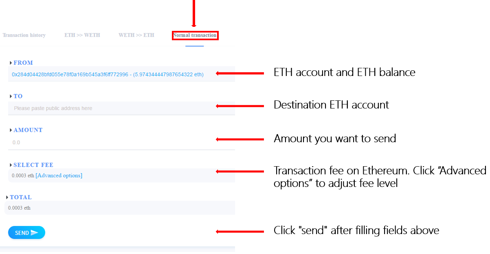
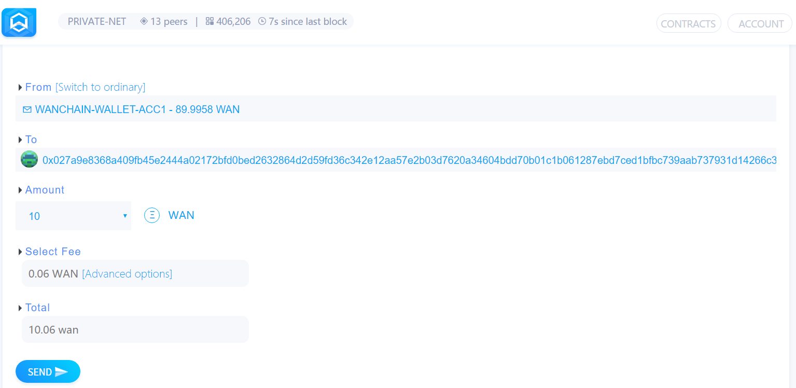
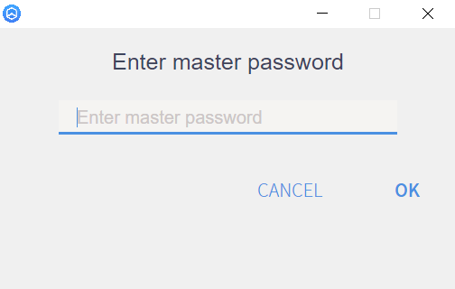
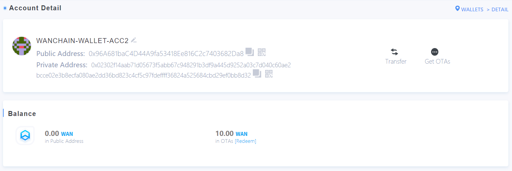

# Wan Wallet GUI全节点钱包使用指南

**本手册为万维链3.0 全节点钱包用户指南，相较于旧版本新添加了比特币与ERC20的跨链交易功能，所以强烈建议升级到最新3.0版本，并建议在升级前将Keystore文件进行安全备份。**

## 重要提示

随着万维链（Wanchain）3.0主网上线，万维链现支持与以太坊，比特币，ERC20代币的跨链交易。之前版本的万维链钱包在万维链3.0发布之后依旧能够正常运行，但3.0的新功能（例如比特币和ERC20的跨链交易）需要3.0或更高版本的万维链钱包才能运行，所以强烈推荐您升级到最新版本的万维链钱包。

对于旧版本的万维链钱包用户，虽然升级过程并不会以任何形式修改现有的keystore文件（秘钥文件），但为了避免出现任何数据丢失，强烈建议您**在升级钱包之前将keystore 文件（私钥文件）进行安全备份**。

本手册将着重讲解如何使用万维链钱包3.0发送BTC或ERC20代币到万维链上，或者从万维链上提取BTC或ERC20代币到比特币链上或以太坊链上。手册中以MKR（MakerDao的权益和管理代币）作为ERC20跨链交易的范例。请使用3.0或更高版本的万维链钱包，或访问https://www.wanscan.org/tokens ，浏览最新的ERC20代币支持列表。未来万维链钱包将会支持更多的ERC20代币。

实际上，3.0或更高版本的万维链钱包可以支持任意种类的ERC20代币，仅需万维链基金会提供相应的后端支持，无需用户和ERC20代币发行方进行任何操作。

用户可在万维链钱包中切换使用BTC/ETH/WAN的主网和测试网络。此版本的万维链钱包集成了BTC/ETH的轻钱包和WAN的全节点钱包。

## 下载与安装包校验

在此链接下载万维链钱包3.0安装文件：https://wanchain.org/products

- 万维链钱包3.0支持**Linux**, **Windows**, **MacOS**, 请下载您操作系统对应的安装文件；
- 请检查安装文件的**SHA256哈希值**以验证您正在运行未经篡改的安装文件. 您可以在此链接找到钱包的下载地址，及其SHA256哈希值：https://wanchain.org/products

## 启动
解压或安装钱包安装包，运行，点击**LAUNCH APPLICATION**按钮来启动钱包。

-	Windows: WanWalletGui.exe
-	MacOS: WanWalletGui 

点此启动

-	Linux:        

通过CLI命令行安装： `sudo dpkg -i WanWalletGui-linux64-2.X.X.deb`

* 使用主网启动钱包（命令行）: `wanwalletgui`                

* 使用测试网启动钱包（命令行）: `wanwalletgui --network testnet`

* 或者点击`/usr/local/bin/`上当下Wanwalletgui图标启动

## 主网/测试网切换

万维链钱包3.0的BTC、ETH和ERC20跨链交易，在万维链、以太坊、比特币的主网和测试网上都能使用。可以随时通过点击钱包界面左上方的万维链图标访问钱包的万维链账户一览（默认的启动页面）。

使用下图所示菜单项 (**Develop--->Network**) 来进行主网和测试网之间的切换。 注意：请勿将主网WAN代币发送到测试网络，此操作可能会导致代币永久性丢失。

## 创建和备份账户

1. 下图所示File下拉菜单中的3个选项可允许用户创建新的WAN、ETH账户，或新的BTC地址；

2. 直接点击钱包界面右上角的**CREATE ACCOUNT**按钮仅能创建新的WAN账户；

注意：万维链钱包中的所有BTC地址都应使用相同的密码 (与第一次使用万维链钱包创建BTC地址时的密码相同)

3. 用户也可以使用下图框出的导入功能导入已有WAN或ETH账户的钱包keystore文件（私钥文件）

4. 备份功能（Backup）则会打开本地WAN或ETH keystore文件（私钥文件）的文件位置，或BTC钱包数据库的文件位置

# 转账交易指南

1. [跨链交易](#crosschain)   
  * [ETH到Wanchain](#ethtowan)
  * [WETH到ETH](#wethtoeth)
2. [普通WAN交易](#wan)
3. [普通ETH交易](#eth)   
4. [隐私交易](#private)   

  

## 跨链交易

点击CROSSCHAIN按钮进行跨链交易

在进行跨链交易之前，请通过万维链钱包，或下方提供的explorer链接，检查账户上的WAN、ETH或BTC余额。在测试网上，可通过下方提供的faucet链接，获取WAN和BTC的测试币。

主网：

* ETH: https://etherscan.io/

* WAN: https://www.wanscan.org/

测试网：

* ETH: https://rinkeby.etherscan.io/

* WAN: http://13.58.108.244/

  

### 发送ETH到Wanchain

点击"ETH >> WETH"

选择待发送的ETH地址（From），选择待接收的WAN地址（To），输入要跨链转账的ETH数量（Amount），其他项均可保留默认值。然后点击发送（Send）。

此时，在弹出的页面，用户需要输入发送地址的密码和接收地址的密码，点击OK。

这时，用户只需要耐心等待个几分钟，跨链转账便完成了。

所以，简单讲，完成跨链操作，用户只需填写发送方地址和接收方地址、发送地址密码和接收地址密码，便可以完成代币的跨链转账。

#### 确认交易和取消交易

 在"Transaction history"界面，点击“**Confirm**" 完成跨链转账。

如果您在哈希时间锁定期内不确认，那么该笔转账会解锁并退还至原ETH账户。"Confirm"会变成"**Cancel**"，在按钮变红前，点击"**Cancel**"完成交易的取消。

### 发送WETH到ETH

如果您的Wanchain平台上有WETH，便可进行该项跨链操作。

点击"WETH >> ETH"。    

此操作过程与ETH到Wanchain非常类似，可参考上述的操作步骤。

  

## 普通WAN转账

在钱包首页点击"Transfer". 

填写"To"和"From"地址，"Amount"和"Fee"值, 然后点击"Send"完成WAN的普通转账。

 

## 普通ETH转账

Wanchain钱包同样提供ETH之间的转账功能。

点击"Normal transaction"，填写源地址和目标地址，转账金额，转账费，然后点击"SEND"

 

## 隐私交易

>#### 隐私交易须要有公共地址（短地址）和隐私地址（长地址）  
>普通交易的过程，地址是公开的，因此转账记录链上可查。但隐私交易的过程进行了隐私加密，因此，转账记录是完全匿名的。  
>**公共地址示例**  
>`0xefe000C1b9f9ca9bf063857aAF5fCb7B8A25eaA1`  
>**隐私地址示例**  
>`0x02bddd6c139a10c5c9e81d1d6438dd26bc4a26824a2c729819d21ee1fca8b2dbc203936c798596ac4adcbe89e96c88397894b6dfab14a95ea7e137c31f56b9c81255`  

### 发送隐私交易

**步骤1**: 点击**Transfer**

**步骤2**: 在 **From**栏点击**Switch to Private**，在**To**栏输入**隐私地址**。因此，目标用户需要提前告知他的隐私地址。输入要转账的金额。点击**SEND**。 

**步骤3**: 输入发送地址的**密码**，点击**SEND TRANSACTION**。 

**步骤4**: 最新一笔转账会在**Transaction List**中呈现。 

**步骤5**: 在**Wanchain浏览器**上, **Value**和**To**地址均被隐藏，无法公开查询。

### 接收隐私交易

**步骤1**: 点击**Details**，查看详情。

**步骤2**: 点击**Get OTA (One Time Address)** ，开始执行隐私交易代币的接收。

**步骤3**: 输入账户的**密码**，点击**OK**

**步骤4**: 等待几分钟，按钮出现**Redeem**

**步骤5**: 点击 **Redeem**完成隐私交易代币的接收。

**步骤6**: 交易详情展示在**Redeem from OTAs**中

